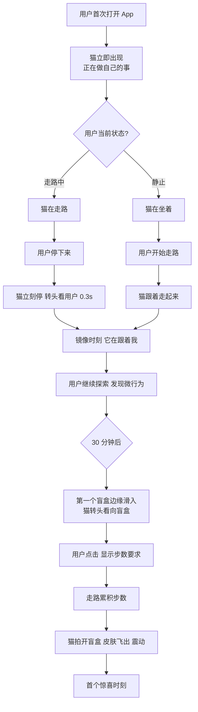
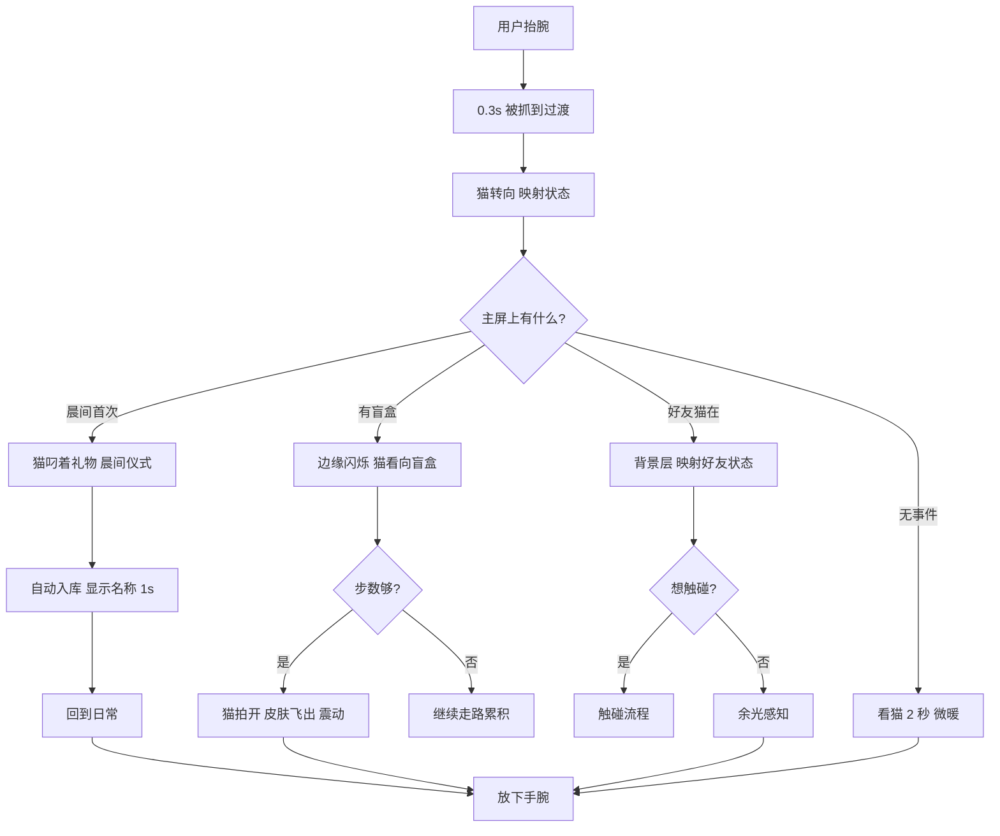
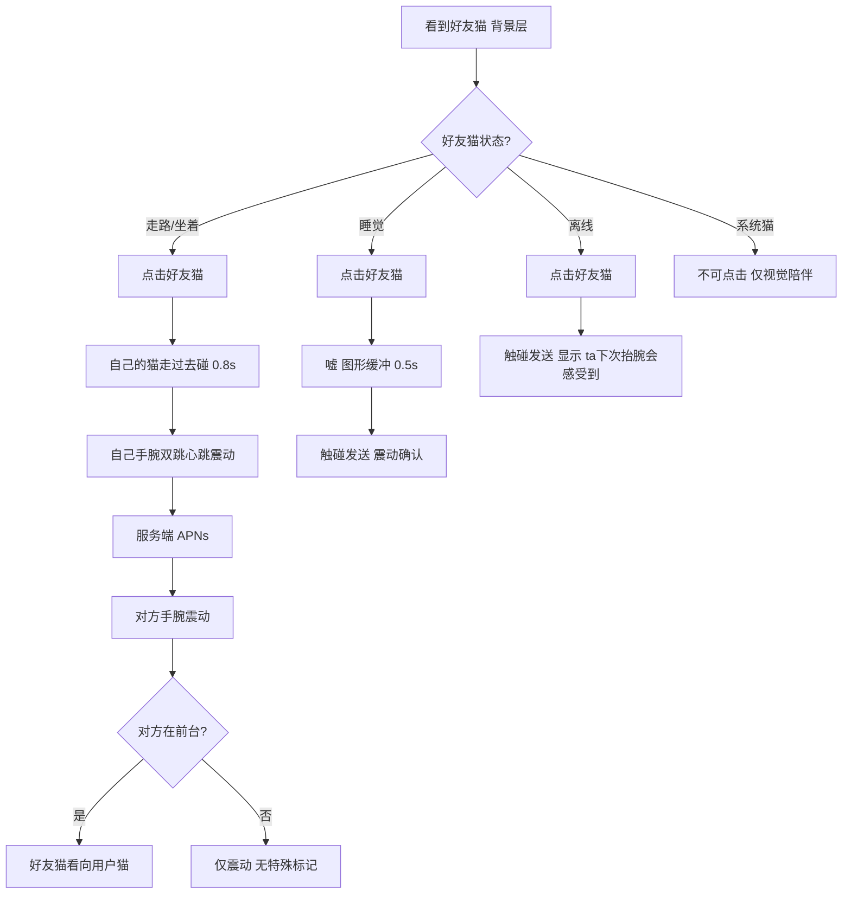
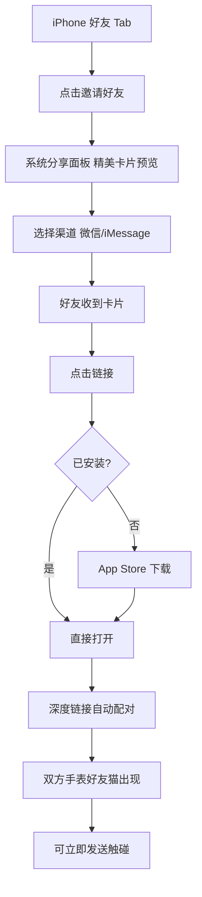
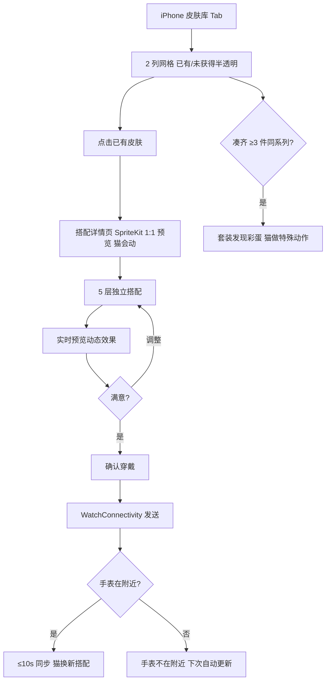

# UX Design Specification - 裤衩猫 (cat)

**Author:** Zhuming
**Date:** 2026-03-27

---

## Executive Summary

### Project Vision

裤衩猫是一款 Apple Watch 原生的触觉社交宠物 App，产品本质是"手腕上的情绪微针灸"。用户手腕上住着一只极简风格的猫，实时映射用户的身体状态——走路时猫走路，静坐时猫打盹，睡觉时猫蜷起来。

三大创新支柱定义了 UX 方向：
1. **活的映射（Living Mirror）** — 猫是用户物理状态的因果投射，不是循环动画
2. **触觉社交（Haptic Social）** — 手腕震动传递情感，零文字的最轻社交
3. **零压力收集** — 永远没有惩罚，只有正反馈

核心体验模型：Complication 入口 + App 深度交互，95% 一瞥即走 / 5% 沉浸。iPhone 伴侣 App 承担获客、皮肤搭配、好友管理和支付。

### Target Users

**主要用户画像：**

| 画像 | 特征 | 核心需求 | 使用场景 | 核心担忧 | 未被满足的需求 |
|------|------|---------|---------|---------|--------------|
| 小林（单机核心） | 26岁程序员，Apple Watch 用户 | 工作间隙的微小正反馈 | 久坐提醒、盲盒解锁、换装 | 被动观察无法触发"啊哈"感；走/坐/睡三态不够，第三天就无聊 | 随机微行为的丰富度决定留存 |
| 小雨（社交核心） | 23岁设计师，异地恋 | 最轻形态的情感连接 | 触碰发送、好友猫状态、睡前互动 | 不确定"现在适不适合发触碰"；触碰缺少闭环回应 | 好友猫状态需传达情感上下文 |
| 阿毛（收集核心） | 28岁设计师，收集爱好者 | 搭配展示的满足感 | iPhone 皮肤搭配、截屏分享、签到收集 | 零稀有度=零炫耀动力；预览与实际手表显示不一致 | 搭配在好友手表上的完整展示 |

**共同特征：** 渴望微小正反馈的 Apple Watch 年轻用户，核心场景是异地情侣和办公室搭子。

### Key Design Challenges

1. **极小屏幕多猫同屏** — 最多 3 只猫在 ~45mm 屏幕上共存，需独立点击区域且不误触，自己的猫最大（40%屏幕），好友猫稍小（25%）
2. **零引导 Onboarding** — 无文字教程、无弹窗，用户 60 秒内需自行发现"猫在跟着我动"的镜像时刻
3. **触觉社交反馈设计** — "点击好友猫 = 触碰"的交互必须自然且不误触，发送/接收的触觉时序需要精心设计
4. **手表/iPhone 体验分割** — 用户需要清晰的心智模型来区分"手表做什么 vs iPhone 做什么"
5. **盲盒动画的性能约束** — 展示动画在手表上需兼顾惊喜感与电量预算
6. **镜像时刻的"啊哈"触发** — 被动观察无法产生发现感，需要因果断裂点（如用户停下→猫立刻停）引导用户自行领悟
7. **触碰的情感上下文与闭环** — 用户不确定"现在适不适合发触碰"，需要通过好友猫状态传达可读的情感上下文
8. **好友猫优先级排序** — 3 只猫同屏但亲密度不同（MVP 只有 1 好友，Growth 阶段 4 人才需要排序机制）
9. **单屏架构下的信息密度管理** — 主屏可能同时存在猫、好友猫、盲盒、签到动画，需要时序优先级规则

### Design Opportunities

1. **触觉语义系统** — 设计一套可识别的触觉语言（盲盒惊喜 = 三连短促+长震，好友触碰 = 双跳心跳，久坐提醒 = 缓慢渐强），让用户形成肌肉记忆
2. **猫性格微交互** — 利用猫"傲娇不讨好"的性格设定，通过延迟回应和随机微行为创造大量"发现时刻"
3. **截屏即传播** — 任何时刻截屏都好看，iPhone 皮肤预览成为"社交素材生产器"
4. **Complication 情感锚点** — 用户每天看表盘几十次，猫状态插画成为最高频的情感接触点
5. **隐式稀有度感知** — 不标注稀有度但通过出现频率、获取途径差异让收集用户感受到"我有你没有"
6. **触碰情感上下文** — 好友猫睡觉时点击加 0.5 秒"嘘…"缓冲再发送（深夜触碰比白天更有重量）；好友离线时显示"ta 下次抬腕会感受到"
7. **1:1 手表模拟预览** — iPhone 搭配界面精确模拟手表显示效果
8. **抬腕"被抓到"过渡** — 每次抬腕时猫有 0.3 秒正在做自己的事（舔爪子/追尾巴/发呆），察觉用户后才转过来，创造"猫有自己生活"的感觉
9. **触碰"猫走过去碰一下"动画** — 点击好友猫后你的猫慢慢走过去碰一下（0.8 秒），让触碰从技术操作变成情感行为
10. **"猫叼礼物回来"替代签到** — 每天第一次看猫时猫叼着一个小礼物等你，完全消除"签到"心智模型的压力感
11. **"晨间仪式"合并** — 签到+过夜盲盒合并为一个 3 秒动画，一次抬腕双倍惊喜
12. **猫即导航** — 猫的视线和行为作为隐性功能引导（猫走到边缘=换装，猫盯某处=盲盒），与单屏架构完美配合

### Technical Constraints for UX

| 约束 | 影响 | UX 应对 |
|------|------|--------|
| 好友猫渲染限制 | 副猫半分辨率 60×60，降帧 12fps，最多 2 层纹理 | 简化为身体+头饰 2 层，头饰最能传达个性 |
| 后台无法触发动画 | 推送只能触发震动，不能执行猫动画 | 前台版（猫互动动画）和后台版（仅震动）两套反馈 |
| Complication 无自定义动画 | 苹果系统限制，只能静态图片 | "伪动画"策略：时间线切换不同姿态插画 |
| 总额外耗电 ≤10% | 动画≤5% + 网络≤3% + 传感器≤2% | 抬腕才渲染，非交互降帧，Always-On 静态 |
| 手表内存 ~200-300MB 可用 | 3 猫全皮肤渲染内存超限 | 主猫全层渲染，好友猫简化 2 层 |

### Design Decisions

| 决策 | 内容 | 依据 |
|------|------|------|
| 触碰人际真实性 | 触碰永远由人发起，猫不代替人自动回应。前台收到触碰时好友猫"看向你的猫"，不自动蹭头 | 保护"暧昧比精确更有力量"的设计哲学 |
| 手表单屏架构 | 主屏是唯一常驻屏幕，盲盒/签到/换装全在主屏内完成，无 Tab 导航 | watchOS 95% 一瞥即走的体验模型 |
| 盲盒动画简化 | 两阶段 1.5 秒（猫一爪拍开→皮肤飞出猫接住展示），替代三阶段 4.3 秒 | 符合手表"一瞥即走"，猫拍开自带性格 |
| MVP 消除好友猫名字标签 | MVP 只有 1 个好友，用皮肤搭配区分，Growth 多好友时再加标签 | 45mm 屏幕上文字占空间且打破视觉美感 |
| 猫对猫互动动画 | MVP 不做，Growth 阶段作为社交深度功能 | 后台无法触发动画 + MVP 范围控制 |
| 好友猫优先级排序 | MVP 不需要，Growth 阶段 4 人联机时设计 | MVP 只有 1 个好友 |
| 签到重包装 | "猫每天叼礼物回来"替代传统签到概念 | 真正消除签到压力，符合零压力哲学 |
| 主屏时序优先级 | 盲盒掉落 > 签到/礼物 > 好友猫状态更新 | 防止单屏信息过载 |

## Core User Experience

### Defining Experience

裤衩猫的核心交互是**抬腕看猫**。每天 80+ 次抬腕中，猫以不同状态迎接用户——0.3 秒"被抓到"过渡 → 猫的状态一瞥即懂 → 放下手腕，全程 < 2 秒。一切设计围绕"让这一眼值得"。

核心体验循环：
1. **被动层**（自动发生）：猫映射状态 → 盲盒掉落 → 步数累积
2. **一瞥层**（抬腕 2 秒）：看猫状态 → 看好友猫 → 发现礼物/盲盒
3. **互动层**（主动 5-10 秒）：拍开盲盒 → 发送触碰 → 快速换装
4. **深度层**（iPhone App）：皮肤搭配 → 好友管理 → 收集浏览

### Platform Strategy

| 平台 | 角色 | 交互模式 | 时间占比 |
|------|------|---------|---------|
| Apple Watch 主屏 | 核心情感体验 | 一瞥即走 | 95% |
| Complication | 最高频触点 | 被动扫视 | — |
| iPhone 伴侣 App | 深度操作中心 | 主动使用 | 5% |

**单屏架构：** 手表端只有一个屏幕。没有 Tab、没有菜单、没有层级导航。猫是界面，猫是导航，猫是内容。

**离线优先：** 核心体验（猫动画+盲盒+签到）100% 离线可用。

### Effortless Interactions

| 交互 | 设计 | 无感原因 |
|------|------|---------|
| 签到 | 打开即完成，猫叼着礼物等你 | 没有"签到"概念，没有按钮 |
| 盲盒解锁 | 走路自动累积，到了就开 | 不需要主动操作 |
| 猫状态映射 | CMPedometer 自动驱动 | 用户不需要告知状态 |
| 好友状态更新 | 30 秒静默轮询 | 好友猫自动变化 |
| 皮肤同步 | iPhone 搭配后自动推送手表 | 手表端零操作 |
| 低电量降级 | 自动切静态，Complication 不断 | 不打扰用户 |

**竞品痛点消除：** 猫不会饿死（vs Tamagotchi）、不排名（vs 微信运动）、不惩罚断签（vs 传统签到）。

### Critical Success Moments

| 时刻 | 触发 | 用户感受 | 失败后果 |
|------|------|---------|---------|
| 镜像时刻 | 首次打开，猫映射用户状态 | "它在跟着我！" | 用户当天卸载 |
| 首次触碰 | 配对后第一次双方震动 | "ta 感受到了！" | 社交功能废了 |
| 首个礼物 | 猫叼着礼物等你 | "太可爱了" | 核心循环断裂 |
| 被抓到时刻 | 抬腕看到猫正在做自己的事 | "它刚才在干嘛" | 第三天无聊 |
| 深夜触碰 | 好友猫在睡觉+"嘘…"缓冲 | "这个触碰更珍贵" | 触碰变机械操作 |

### Experience Principles

1. **猫是界面（Cat IS the Interface）** — 没有按钮没有菜单。猫的行为就是功能入口，用户不是在"操作 App"，是在"和猫相处"
2. **一瞥值得（Every Glance Matters）** — 每次抬腕都有一点不同。连续两次看到完全一样的画面 = 设计失败
3. **触碰是人的行为（Touch is Human）** — 系统永远不代替人发起社交动作。每次触碰的人际真实性是最高优先级
4. **压力为零（Zero Pressure, Always）** — 没有红点、没有未完成计数、没有进度条催促。猫永远在那里，不评判
5. **少即是暖（Less is Warmer）** — 手表屏幕上每多一个元素就少一分温暖。一只猫、一片暖色、一次震动，够了

## Desired Emotional Response

### Primary Emotional Goals

裤衩猫要创造的不是"快乐"或"满足"这种大情绪，而是三种**微情绪**：

| 情感 | 定义 | 用户会说 |
|------|------|---------|
| **微暖（Micro-Warmth）** | 手腕上有一个活着的小东西 | "我的猫刚才在追自己尾巴哈哈哈" |
| **静默连接（Silent Connection）** | 不需要说话就知道ta在 | "我碰了一下他的猫，他震回来了" |
| **无压力的惊喜（Effortless Surprise）** | 不期待也不焦虑的小礼物 | "猫今天叼了个厨师帽回来" |

**差异化情感：** 竞品让用户感受到"我在养一个东西"（责任感）。裤衩猫让用户感受到"有个东西在陪我"（被陪伴感）。核心区别——**养 vs 被陪伴**。

### Emotional Journey Mapping

| 阶段 | 时间线 | 目标情感 | 必须避免 |
|------|--------|---------|---------|
| 首次发现 | 第 0-60 秒 | 惊喜 → "它在跟我动！" | 困惑（"这是什么？"） |
| 首日探索 | 第 1 天 | 好奇 → "它还会做什么？" | 无聊（"就这？"） |
| 首次礼物 | 第 1-2 天 | 微笑 → "太可爱了" | 不理解（"怎么用？"） |
| 首次触碰 | 配对后 24h 内 | 心动 → "ta 感受到了" | 尴尬（"这算什么？"） |
| 日常使用 | 第 3-30 天 | 安心 → "猫还在" | 焦虑（"该签到了"） |
| 深夜触碰 | 任意深夜 | 珍贵 → "比白天的特别" | 打扰（"大晚上震什么"） |
| 收集满足 | 第 7-60 天 | 成就 → "快凑齐了" | 挫败（"又是重复的"） |
| 久坐提醒 | 静坐 1h 后 | 温柔 → "猫在伸懒腰，我也动动" | 烦躁（"别催我"） |
| 出错时 | 网络断/触碰失败 | 淡然 → "没事，下次再碰" | 焦虑（"发送失败！"） |
| 回归 | 断开数日后 | 归属 → "猫还在等我" | 内疚（"好久没打开了"） |

### Micro-Emotions

| 微情绪对 | 裤衩猫的选择 | UX 实现 |
|---------|------------|--------|
| 自信 vs 困惑 | **自信** | 猫状态 0.5 秒内一眼可辨，无需阅读文字 |
| 信任 vs 怀疑 | **信任** | 状态过期诚实显示（半透明+💤），不伪造在线 |
| 惊喜 vs 焦虑 | **惊喜** | 不显示倒计时、不显示"还差X步"、不显示进度条 |
| 成就 vs 挫败 | **成就** | 序列化礼物不重复；套装发现彩蛋 |
| 愉悦 vs 满足 | **愉悦** | "被抓到"过渡、猫拍盲盒、叼礼物——每个微动作有性格 |
| 归属 vs 孤立 | **归属** | 系统猫提供视觉陪伴；猫永远在，不评判缺席 |

### Design Implications

| 目标情感 | 对应 UX 设计决策 |
|---------|-----------------|
| 微暖 | 暖色调视觉系统、猫的圆润线条、"被抓到"过渡动画、随机微行为丰富度 |
| 静默连接 | 好友猫自动出现、触碰只需一次点击、"嘘…"睡觉缓冲、"ta 下次抬腕会感受到" |
| 无压力惊喜 | 隐藏盲盒进度、不显示稀有度、猫叼礼物替代签到、不堆积不过期 |
| 被陪伴感 | 猫有自己的生活（"被抓到"时刻）、不讨好不卖萌、不评判用户行为 |
| 珍贵感 | 深夜触碰"嘘…"仪式感、触碰"猫走过去碰一下"0.8 秒动画、触觉双跳心跳 |

**必须避免的情感：**

| 负面情感 | 触发场景 | UX 防御 |
|---------|---------|--------|
| 焦虑 | 盲盒倒计时、进度条 | 不显示任何进度数字 |
| 内疚 | "你X天没打开了" | 永远不提缺席 |
| 被催促 | 红点、未完成计数 | 零推送式催促，通知只传递正面事件 |
| 尴尬 | 触碰误发、社交暴露 | MVP 只有 1 好友；仅见运动状态不见数据 |
| 挫败 | 重复皮肤 | 序列化不重复；掉率随进度调整 |
| 被打扰 | 震动太频繁 | 同类不超 6 次/小时；夜间自动降低 |

### Emotional Design Principles

1. **温暖优先于效率** — 宁可猫的动画多 0.3 秒过渡，也不要瞬间切换。情感的"慢"不是低效，是温度
2. **诚实优先于乐观** — 离线就显示离线，失败就显示失败。用户信任建立在诚实之上
3. **沉默优先于打扰** — 宁可用户错过一个盲盒，也不要用通知打断生活。猫不催促、不评判、不求关注
4. **发现优先于告知** — 让用户自己发现猫的新行为，而不是文字提示。发现的快乐远大于被告知的满足

## UX Pattern Analysis & Inspiration

### Inspiring Products Analysis

**1. Apple 呼吸 App（watchOS 原生）**

| 借鉴点 | 裤衩猫应用 |
|--------|-----------|
| 邀请式体验——不催促、不评判 | 猫不催促你来，不评判你走 |
| 触觉引导行为而非文字说明 | 久坐时猫伸懒腰 + 渐强震动 = 示范式引导 |
| 零学习成本交互 | 打开即看猫，无教程无弹窗 |

**2. 动物森友会（Animal Crossing）**

| 借鉴点 | 裤衩猫应用 |
|--------|-----------|
| 时间节奏感——早晚氛围不同 | 猫的状态/背景色调随时间变化（晨光暖色→深夜冷静色） |
| "错过也没关系"的 FOMO 反转 | 隐藏微行为只在特定时段出现，错过不提醒不记录 |
| 生活节奏而非任务驱动 | 没有任务清单，猫跟随你的生活而不是你跟随猫的需求 |

**3. 宜家搭配工具（IKEA Place）**

| 借鉴点 | 裤衩猫应用 |
|--------|-----------|
| 搭配组合的独一无二感 | 皮肤收集感来自"我的搭配别人没有"，不是"我抽到稀有款" |
| 场景化预览 | iPhone 皮肤搭配需 1:1 手表模拟预览 |
| 组件自由组合 | 5 层独立搭配，组合数远大于单品数 |

**4. 泡泡玛特（开箱仪式感）**

| 借鉴点 | 裤衩猫应用 |
|--------|-----------|
| 开箱的戏剧性时刻 | 猫一爪拍开盲盒 1.5 秒动画——小但有仪式感 |
| 套装收集成就感 | 凑齐同系列触发"套装发现"彩蛋 |
| **不借鉴** | 显式稀有度标签、重复抽取挫败感、赌博快感驱动 |

**5. 游戏 HUD 设计（塞尔达传说）**

| 借鉴点 | 裤衩猫应用 |
|--------|-----------|
| 多事件单舞台的视觉层级 | 主屏不是"单焦点"而是"多事件单舞台"——用透明度/大小/位置分层 |
| 主角最大最亮，HUD 边缘化 | 自己的猫居中最大，好友猫/事件通知用视觉层级退后 |

**6. Apple Digital Touch（反面教材）**

| 教训 | 裤衩猫的规避 |
|------|------------|
| 入口太深（4 步操作） | 触碰 = 点击好友猫，1 步完成 |
| 独立于场景 | 触碰嵌入看猫场景，好友猫就在旁边 |
| 需要选择类型 | 零选择——点一下就是"我在想你" |

### Transferable UX Patterns

**交互模式：**

| 模式 | 来源 | 裤衩猫应用 |
|------|------|-----------|
| 触觉引导行为 | Apple 呼吸 | 久坐猫伸懒腰 + 渐强震动 |
| 窥探感过渡 | Tamagotchi | 抬腕 0.3 秒"被抓到" |
| 场景内嵌交互 | Digital Touch（反面） | 触碰嵌在看猫场景中 |
| 零选择社交 | Digital Touch（反面） | 点一下 = 发送，不选类型 |
| FOMO 反转 | 动森 | 隐藏行为错过不提醒，下次自然再有 |

**视觉模式：**

| 模式 | 来源 | 裤衩猫应用 |
|------|------|-----------|
| 三层视觉架构 | 游戏 HUD | 前景层（猫+当前事件）→ 背景层（好友猫，稍小稍淡）→ 隐藏层（换装/设置） |
| 时间氛围变化 | 动森 | 早晚色调/猫情绪随时间自然变化 |
| 截屏友好卡片 | Spotify Wrapped | iPhone 皮肤预览 = 社交素材 |
| 搭配组合预览 | 宜家 | 1:1 手表模拟的皮肤搭配界面 |

### Anti-Patterns to Avoid

| 反模式 | 来源 | 裤衩猫的替代 |
|--------|------|------------|
| 死亡/惩罚机制 | Tamagotchi | 猫永远健康，不评判 |
| 任务清单 | Finch | 零待办概念 |
| 多步骤社交发送 | Digital Touch | 1 次点击完成 |
| 显式稀有度标签 | 泡泡玛特 | 搭配独一无二感替代稀有度 |
| 赌博快感驱动 | 泡泡玛特 | 序列化礼物，确定性收集 |
| 进度催促 | 签到类 App | 猫叼礼物，不提天数 |
| 红点/Badge | 通用反模式 | 零红点零计数 |
| 单焦点假设 | 呼吸 App 误用 | 多事件单舞台三层分离 |

### Design Inspiration Strategy

**直接采用：**
- Apple 呼吸的邀请式零压力体验范式
- 游戏 HUD 的三层视觉架构（前景/背景/隐藏）
- 动森的"错过也没关系"FOMO 反转设计

**适配修改：**
- 动森的时间节奏感 → 简化为色调/氛围随时段自然变化（无需完整的季节系统）
- 宜家的搭配预览 → 1:1 手表模拟预览（非 AR，适配手表屏幕尺寸）
- 泡泡玛特的开箱仪式 → 猫拍盲盒 1.5 秒性格化动画（非赌博快感）
- Spotify Wrapped → Growth 阶段"裤衩猫月报"正面数据叙事

**坚决避免：**
- 一切惩罚/死亡/任务清单机制
- 一切多步骤社交操作
- 一切红点/Badge/进度催促
- 一切显式稀有度和赌博驱动

## Design System Foundation

### Design System Choice

**Apple HIG 基底 + 品牌主题层 + SpriteKit 自定义动画层**

三层架构：
1. **系统层（Apple HIG）** — SwiftUI 原生组件用于系统级 UI（导航、列表、设置、通知、权限弹窗）
2. **品牌层（Design Tokens）** — 自定义配色、字体、圆角、间距覆盖 HIG 默认值，双平台分别定义语义化 token
3. **动画层（SpriteKit 自定义）** — 猫世界完全自定义（猫、皮肤、盲盒、好友猫），不受 HIG 约束

### Rationale for Selection

| 因素 | 决策依据 |
|------|---------|
| 手表端 95% 是猫世界 | SpriteKit 自定义，无需传统 UI 组件库 |
| 手表端 5% 系统 UI | Apple HIG 原生最省事，审核安全 |
| iPhone 端皮肤搭配 | HIG 列表/导航 + 品牌主题色 + 自定义预览区 |
| App Store 审核 | HIG 合规降低审核风险 |
| 无障碍 | SwiftUI 原生组件内建 VoiceOver / Dynamic Type 支持 |
| 开发速度 | Claude 对 SwiftUI + HIG 高度熟悉，零学习成本 |
| 品牌辨识度 | Design Tokens 在 HIG 框架内注入品牌个性 |

### Implementation Approach

**手表端实现：**

| 区域 | 技术 | 设计系统 |
|------|------|---------|
| 主屏（猫世界） | SpriteKit SKScene | 完全自定义——猫、皮肤、盲盒、好友猫、事件动画 |
| Complication | WidgetKit | Apple HIG 约束内的自定义插画 |
| 设置（极少） | SwiftUI List/Toggle | Apple HIG + 品牌主题色（米灰/奶白） |
| 通知 | UNNotification | 系统原生样式 |

**iPhone 端实现：**

| 区域 | 技术 | 设计系统 |
|------|------|---------|
| 导航/Tab | SwiftUI TabView/NavigationStack | Apple HIG + 品牌暖色 Accent |
| 皮肤库列表 | SwiftUI LazyGrid | Apple HIG 布局 + 自定义卡片 + **静态预渲染缩略图** |
| 皮肤搭配详情 | SpriteKit（嵌入 SwiftUI） | 完全自定义——1:1 手表模拟，猫会动 |
| 好友管理 | SwiftUI List | Apple HIG + 品牌主题色 |
| 登录/设置 | SwiftUI Form | Apple HIG 原生 |

**注意：** 皮肤库 LazyGrid 中使用预渲染 PNG 缩略图（非动态 SpriteView），避免滚动掉帧。仅在用户点击进入搭配详情页时启动 SpriteKit 动态预览。

### Customization Strategy

**Design Tokens（双平台分别定义）：**

```
tokens/
├── BrandColors.swift     // 品牌色值定义（双平台共享色值）
├── WatchTokens.swift     // watchOS 语义化 token（更暗更克制）
└── iOSTokens.swift       // iOS 语义化 token（更暖更活泼）
```

**watchOS Tokens（克制策略——色彩预算留给猫）：**

| Token | 值 | 说明 |
|-------|------|------|
| Background | 纯黑（OLED 省电） | 系统设置页背景 |
| Surface | 深灰 #1C1C1E | 卡片/列表行背景 |
| TextPrimary | 米白 #F5F5F0 | 主文字（非纯白，减少刺眼） |
| TextSecondary | 灰 #8E8E93 | 辅助文字 |
| Accent | 柔和暖白 | 极少使用，仅高亮交互元素 |
| Font | SF Pro Rounded | Apple 系统圆体 |
| CornerRadius | 12pt | 统一圆角 |

**iOS Tokens（活泼策略——品牌感更强）：**

| Token | 值 | 说明 |
|-------|------|------|
| Background | 米白 #FAF8F5 | 温暖底色 |
| Surface | 白色 #FFFFFF | 卡片背景 |
| Primary | 暖橙 #FF8C42 | 品牌主色，用于 Tab 图标、按钮 |
| Accent | 柔粉 #FFB5B5 | 社交/触碰相关元素 |
| TextPrimary | 深灰 #2C2C2E | 非纯黑，减少对比度 |
| Font | SF Pro Rounded | 与手表一致 |
| CornerRadius | 16pt | 更大圆角，呼应猫的圆润 |
| Shadow | 0 2px 8px rgba(0,0,0,0.06) | 极浅投影 |

### Personality Tokens（品牌节奏规范）

定义猫世界的"性格参数"——所有动画都比预期慢 0.3 秒，这就是猫的性格在 UI 层的表达：

| Token | 值 | 应用 |
|-------|------|------|
| catResponseDelay | 0.3-0.8s | 猫对用户操作的回应延迟（先看一眼再动） |
| eventAppearance | 滑入/浮现 0.5s | 盲盒、礼物从屏幕边缘滑入，不突然出现 |
| eventDismissal | 缓慢淡出 1-2s | 事件结束后缓慢消失，不瞬间切走 |
| touchAnimationDuration | 0.8s | 猫走过去碰好友猫的固定时长 |
| caughtTransition | 0.3s | 抬腕"被抓到"过渡时长 |
| blindboxOpen | 1.5s | 盲盒拍开两阶段总时长 |
| giftPresent | 2s | 猫叼礼物展示时长 |

### Cat Gaze Rules（猫视线引导系统）

猫的视线 = 用户的注意力引导，替代红点/高亮：

| 规则 | 描述 | 目的 |
|------|------|------|
| 猫不主动看用户 | 抬腕时猫在做自己的事，0.3s 后才转过来 | "被抓到"感 |
| 猫看向事件 | 盲盒/礼物出现时猫先转头看 | 引导用户视线到事件 |
| 猫看向好友猫 | 收到触碰时好友猫看向你的猫 | 表示"被碰了" |
| 猫看向屏幕边缘 | 偶尔引导用户发现滑动换装 | 隐性导航引导 |
| 猫不看 UI 元素 | 猫永远不会看向设置按钮或系统通知 | 猫活在自己的世界里 |

## Defining Experience

### The One-Sentence Experience

**"抬手看表，猫在跟着你动。碰一下好友的猫，对方手腕震一下。"**

### Three Defining Moments

| 层级 | 时刻 | 用户会说 | 对标 |
|------|------|---------|------|
| **第一层：活的** | 抬腕看到猫在跟我动 | "我走路猫也走路！" | Instagram 第一张滤镜照 |
| **第二层：碰的** | 点好友猫，对方手腕震了 | "我碰了他的猫，他感受到了" | Tinder 第一次 Match |
| **第三层：收的** | 猫叼着新帽子回来 | "今天猫叼了个厨师帽哈哈" | 泡泡玛特第一次开箱 |

优先级：**活的 > 碰的 > 收的**。如果"活的"不成立，后面两层毫无意义。

### User Mental Model

| 预期来源 | 用户以为… | 实际是… | 转换点 |
|---------|----------|--------|--------|
| Tamagotchi | 需要喂养照顾 | 猫照顾自己 | 发现"猫不会饿" |
| 微信运动 | 步数排行竞争 | 没有排名 | 发现"没有排行榜" |
| 手表通知 | 推送骚扰源 | 震动是好友在想你 | 第一次收到触碰震动 |
| 表盘装饰 | 静态壁纸 | 猫在动且跟我同步 | 镜像时刻 |

心智模型转换策略：全部通过体验本身教学，零文字引导。

### Success Criteria

| 标准 | 指标 | 成功信号 |
|------|------|---------|
| 镜像时刻生效 | 内测 10 人中 ≥8 人 60 秒内自述"猫跟我动" | 零教程理解 |
| 触碰闭环完整 | 发送→对方震动 < 5 秒 | 感觉"即时" |
| 礼物带来微笑 | 盲盒解锁率 ≥ 70% | 愿意走几步去开 |
| 不产生焦虑 | 用户从不说"我该签到了" | 零压力哲学成立 |
| 想给朋友看 | 首周邀请链接生成率 ≥ 10% | 自传播力 |

### Novel UX Patterns

| 交互 | 模式类型 | 教学策略 |
|------|---------|---------|
| 抬腕看猫（活的映射） | **新颖** | 不教——镜像时刻让用户自己发现 |
| 点击好友猫（零选择触碰） | **新颖** | 不教——第一次震动反馈建立心智 |
| 猫叼礼物（签到重包装） | **组合创新** | 不教——猫叼着东西站那里，用户自然会点 |
| 左右滑动换装 | **成熟** | 零学习成本 |
| Complication 入口 | **成熟** | watchOS 标准模式 |

### Experience Mechanics

**机制 1：抬腕看猫（每日 80+ 次）**

| 阶段 | 时长 | 发生什么 | 用户感受 |
|------|------|---------|---------|
| 触发 | 0s | 用户抬腕，屏幕亮起 | — |
| 被抓到 | 0-0.3s | 猫正在做自己的事，察觉到用户 | "它刚才在干嘛？" |
| 转向 | 0.3-0.5s | 猫转过来，映射当前运动状态 | "它在看我" |
| 一瞥 | 0.5-2s | 扫视：猫 → 好友猫 → 事件 | 微暖 / 连接 |
| 放下 | 2s+ | 放下手腕，屏幕熄灭 | 安心 |

**机制 2：发送触碰（日均 3+ 次）**

| 阶段 | 时长 | 发生什么 | 用户感受 |
|------|------|---------|---------|
| 发现 | — | 好友猫在背景层 | "ta 在走路呢" |
| 点击 | 0s | 手指点击好友猫 | — |
| 猫走过去 | 0-0.8s | 自己的猫走过去碰好友猫 | "我的猫去碰了" |
| 发送确认 | 0.8s | 自己手腕双跳心跳震动 | 确认感 |
| 对方震动 | ~5s | 对方震动 + 好友猫看向用户猫 | — |
| *好友睡觉* | +0.5s | "嘘…"缓冲再发送 | 珍贵 |
| *好友离线* | — | "ta 下次抬腕会感受到" | 温暖 |

**机制 3：猫叼礼物 + 盲盒（每日多次）**

| 阶段 | 时长 | 发生什么 | 用户感受 |
|------|------|---------|---------|
| 晨间仪式 | — | 当日首次抬腕，猫叼着礼物 | "今天有什么？" |
| 展示 | 0-1s | 猫把礼物放到面前 | 好奇 |
| 获得 | 1s | 自动入库，短暂显示名称 | 微笑 |
| 盲盒出现 | — | 30 分钟后边缘闪烁 | — |
| 猫注意到 | 0.3s | 猫转头看盲盒（视线引导） | "那是什么？" |
| 步数解锁 | 累积 | 200-300 步达标 | — |
| 猫拍开 | 0-0.5s | 猫一爪拍开 | 期待 |
| 飞出展示 | 0.5-1.5s | 皮肤飞出猫接住 + 三连短促+长震 | 惊喜 |
| 入库 | 1.5s | 存入库存，猫回到日常 | 满足 |

## Visual Design Foundation

### Color System

**核心色彩哲学：手表克制，iPhone 温暖，猫世界独立。**

**品牌色值定义（双平台共享色值）：**

| 色彩角色 | 色值 | 色名 | 情感联想 |
|---------|------|------|---------|
| Brand Warm | #FF8C42 | 橘猫暖 | 温暖、活泼 |
| Brand Soft | #FFB5B5 | 柔粉 | 亲密、社交 |
| Brand Cream | #FAF8F5 | 奶油白 | 柔和、舒适 |
| Brand Gray | #F5F5F0 | 米灰 | 安静、克制 |
| Accent Green | #A8D5BA | 薄荷绿 | 清新、获得 |
| Danger Soft | #FFB4A2 | 软珊瑚 | 温和警告 |

**watchOS 语义化色彩（克制策略——色彩预算留给猫）：**

| 用途 | 色值 | 说明 |
|------|------|------|
| 背景 | #000000 纯黑 | OLED 省电 + 纯黑舞台策略 |
| 系统 UI 表面 | #1C1C1E | 设置页卡片 |
| 主文字 | #F5F5F0 米灰 | 非纯白，减少刺眼 |
| 辅助文字 | #8E8E93 | 系统灰 |
| Accent | #F5F5F0 米白 | 极少用，仅高亮交互 |

**watchOS 色彩规则：** 手表系统 UI 只使用黑/灰/米白。所有色彩预算留给 SpriteKit 猫世界。背景**始终纯黑**——时段氛围通过猫身上的光照变化实现，不使用背景渐变。

**iOS 语义化色彩（活泼策略）：**

| 用途 | 色值 | 说明 |
|------|------|------|
| 背景 | #FAF8F5 奶油白 | 温暖底色 |
| 表面 | #FFFFFF 白 | 卡片、列表项 |
| 主色 | #FF8C42 橘猫暖 | Tab 图标、主按钮 |
| 社交色 | #FFB5B5 柔粉 | 好友相关 |
| 成功 | #A8D5BA 薄荷绿 | 新皮肤获得 |
| 主文字 | #2C2C2E 深灰 | 非纯黑 |
| 错误 | #FFB4A2 软珊瑚 | 温和提示 |

**iOS 甜度上限规则——每页最多一种暖色主角：**

| 页面 | 主角色彩 | 配角 | 禁止 |
|------|---------|------|------|
| 首页 | 猫本身暖色 | 灰色文字统计 | 橘+粉不同时出现在文字/按钮上 |
| 皮肤库 | 橘猫暖（Tab+按钮） | 卡片中性白/灰 | 卡片不加彩色边框 |
| 好友页 | 柔粉（头像框/触碰记录） | 橘色退让给 Tab | 不用渐变混合橘+粉 |
| 搭配预览 | 猫和皮肤自身色彩 | UI 纯灰白 | 预览区周围无品牌色 |

**深色模式：** watchOS 天然纯黑；iOS 支持系统深色——奶油白→#1C1C1E，白卡片→#2C2C2E，文字反转。

**SpriteKit 猫世界色彩（独立于 UI Token）：**

| 规则 | 说明 |
|------|------|
| 暖色基调 | 猫默认偏暖（橘/奶油/米色），与 UI 暖色调呼应 |
| 时段光照 | 用**色相偏移**实现（暖黄→冷蓝白），**不降低亮度**。深夜的猫不变暗，而是色温从暖变冷 |
| 猫最低亮度 | HSB Brightness ≥ 60%。深色皮肤特殊处理：加粗轮廓 3pt + 光晕亮度提高 |
| 猫环境光晕 | 猫周围 5-8px 极淡暖色（#0A0805 左右），传达"猫是温暖光源"+ OLED 抗锯齿 |
| 好友猫降低饱和 | 好友猫整体饱和度 -20%，区分前景/背景层 |
| 获得粒子效果 | 新皮肤/盲盒开启时 2-3 个微粒子缓慢上浮消散（1-2 秒），"刚出炉"的新鲜感 |
| 皮肤色彩独立 | 每套皮肤有自己的色板，不受品牌色限制 |

### Typography System

**唯一字体：SF Pro Rounded**

| 决策 | 理由 |
|------|------|
| 不用自定义字体 | 系统字体渲染最优、watchOS 兼容最佳、无需打包 |
| 选择 Rounded 变体 | 圆角字形与猫的圆润线条一致，更"温暖" |
| 双平台统一 | 品牌一致性 |

**watchOS 字号层级：**

| 层级 | 字号 | 字重 | 场景 |
|------|------|------|------|
| Title | 20pt | Semibold | 设置页标题 |
| Body | 16pt | Regular | 设置项文字 |
| Caption | 13pt | Regular | 好友昵称（Growth） |
| Tiny | 11pt | Medium | "ta 下次抬腕会感受到" |

**手表端零文字规则：** 猫世界主屏无持久性文字。文字仅出现在：设置页、离线触碰提示（图形化为主）、皮肤名称短暂闪现（1 秒后消失）。

**iOS 字号层级：**

| 层级 | 字号 | 字重 | 用途 |
|------|------|------|------|
| Large Title | 34pt | Bold | 页面标题 |
| Title 2 | 22pt | Bold | 分区标题 |
| Headline | 17pt | Semibold | 卡片标题 |
| Body | 17pt | Regular | 正文 |
| Subheadline | 15pt | Regular | 辅助说明 |
| Caption | 12pt | Regular | 最小文字 |

全部使用 Dynamic Type 语义化调用，天然支持系统字体缩放。

### Spacing & Layout Foundation

**基础间距单位：4pt**

| Token | 值 | 用途 |
|-------|------|------|
| space-xs | 4pt | 图标与文字间 |
| space-sm | 8pt | 列表项内部间距 |
| space-md | 12pt | 卡片内边距 |
| space-lg | 16pt | 区块间距 |
| space-xl | 24pt | 页面级分隔 |
| space-2xl | 32pt | 大区块（仅 iPhone） |

**watchOS 主屏三层视觉布局：**

| 层级 | 内容 | 尺寸/位置 | 透明度 |
|------|------|---------|--------|
| 前景层 | 自己的猫 + 当前事件 | 居中，占 40% 屏幕 | 100% |
| 背景层 | 好友猫 | 偏右下，60×60，12fps | 85%（稍淡） |
| 隐藏层 | 换装/设置 | 屏幕外，手势触发 | — |
| 氛围层 | 纯黑底 + 猫身上光照变化 | 全屏底层 | — |

**watchOS 布局规则：** 触摸目标 ≥ 44pt，圆形屏幕边缘 ~8pt 安全区，设置页用系统默认间距。

**iOS 布局规则：** 宽松呼吸感（space-lg 默认）、16pt 大圆角卡片、皮肤库 2 列 LazyGrid 正方形卡片、搭配预览居中留白、5 Tab 底栏（首页/皮肤库/搭配/好友/设置）。

### Art Direction（美术规范）

**线条风格：**

| 规范 | 说明 |
|------|------|
| 基础线宽 | 2-3pt，带微弱手绘抖动（非完美曲线） |
| 粗细呼吸 | 柔软处（肚子、脸颊、尾巴尖）变细变淡（1.5pt, 80%）；结构处（耳朵尖、爪子、背脊）粗实（2.5pt, 100%） |
| 填充不到边 | 填充色与轮廓线之间留 0.5pt 呼吸间隙 |
| Complication 专用 | 线条加粗至 3-4pt（小尺寸可辨），简化为头+身体轮廓+关键特征，保持手绘质感不简化为矢量图标 |

**呼吸微动规范：**

| 状态 | 节奏性微动 | 频率 | 幅度 |
|------|-----------|------|------|
| idle（静坐） | 身体微微起伏 | 2.5-3.5s/次（±0.5s 随机） | 1-2px |
| walking | 随步伐微微上下 | ~0.5s/步 | 2-3px |
| sleeping | 明显呼吸起伏 | 3.5-4.5s/次（±0.5s 随机） | 3-4px |
| 好友猫 | 同样有呼吸微动 | 2.5-3.5s/次 | 1px（更微弱） |

**关键规则：** 微动不能有固定节奏——加 ±0.5 秒随机偏移，猫的呼吸不是钟摆。

**猫态系统状态替代（零系统 UI 入侵）：**

| 系统状态 | 猫世界视觉 | 替代了什么 |
|---------|-----------|-----------|
| 加载中 | 猫趴着，尾巴有节奏地左右摆 | 系统 spinner |
| 网络错误 | 猫歪头，头上手绘"？" | 系统错误弹窗 |
| 好友离线 | 好友猫半透明 + 💤 | 灰色"离线"文字 |
| 空皮肤库 | 猫站在空衣柜前歪头看你 | "暂无皮肤"占位 |
| 配对等待 | 猫坐着左右张望 | "等待好友接受"文字 |
| 触碰失败 | 好友猫上方手绘风"❌"（1 秒消失） | 系统错误 toast |

## Design Direction Decision

### Design Directions Explored

生成了 7 个设计方向变体（详见 `ux-design-directions.html`）：

| 方向 | 风格 | 核心特点 |
|------|------|---------|
| A. Minimal Zen | 极致克制 | 纯黑舞台、信息密度最低、零文字 |
| B. Warm Glow | 温暖光感 | 猫自带光晕、微暖氛围渐变 |
| C. Playful Pop | 活泼细节 | 可见轮廓线、胡须尾巴、最接近黄油猫 |
| D. Night Mode | 深夜时段 | 冷色调色相偏移、月亮星点 |
| E. Social Focus | 好友同屏 | 2 猫布局、触碰脉冲提示 |
| F. Complication | 表盘入口 | Rectangular + Circular 规格 |
| G. iPhone App | 伴侣 App | 奶油白底、5 Tab、皮肤库网格 |

### Chosen Direction

**组合方向：A 的布局 + C 的猫风格 + B 的光晕**

- **框架层（A）：** 极简布局——纯黑舞台、三层视觉分离（前景/背景/隐藏）、零文字、信息密度最低
- **角色层（C）：** 黄油猫风格——可见手绘轮廓线（2-3pt 抖动）、耳朵内粉色、眼睛高光点、胡须可见、尾巴摆动动画
- **氛围层（B）：** 环境光晕——猫周围 5-8px 微暖发光，"小夜灯"感
- **时段层（D）：** 色相偏移（暖→冷）不降亮度，深夜加月亮/星点作为猫世界道具
- **社交层（E）：** 好友猫右上偏小、降饱和度、绿色状态点
- **Complication（F）：** 手绘风加粗线条，Rectangular 猫+文字，Circular 仅猫头
- **iPhone（G）：** 奶油白底、橘色 Accent、5 Tab、皮肤库 2 列网格

### Design Rationale

| 选择 | 理由 |
|------|------|
| A 的布局作为框架 | 最符合"少即是暖"和"猫是界面"体验原则，OLED 利用最优 |
| C 的猫风格 | 最接近黄油猫参考，轮廓线和细节（胡须/尾巴/耳朵粉色）增加角色辨识度和"活的"感觉 |
| B 的光晕 | 增加"温暖光源"感 + 解决 OLED 高对比度锯齿问题，双重实用价值 |
| 不选 B 的底部渐变 | 违反"纯黑舞台"规则，削弱猫的视觉突出度 |
| 不选 A 的极简猫 | 缺少黄油猫辨识度，猫的"性格"不够 |

### Implementation Approach

**手表端 SpriteKit 实现优先级：**

1. 猫角色渲染（C 风格 Sprite Sheet + 呼吸微动）
2. 环境光晕（B 风格，SKEffectNode 或预渲染到 Sprite Sheet）
3. 三层布局系统（A 框架，z-order 管理前景/背景/隐藏层）
4. 时段光照（D 风格，色相偏移 shader 或预渲染变体）
5. 好友猫渲染（E 布局，简化 2 层 + 降饱和度）

**iPhone 端 SwiftUI 实现：**

1. Tab 架构（G 的 5 Tab 布局）
2. 皮肤库 LazyGrid（静态缩略图 + 详情页 SpriteKit）
3. 首页猫状态展示
4. 品牌 Token 应用（奶油白底 + 橘色 Accent）

### Accessibility Considerations

| 维度 | 策略 |
|------|------|
| 对比度 | 所有文字 WCAG AA（4.5:1+）。#2C2C2E 在 #FAF8F5 上 = 12.6:1 |
| Dynamic Type | SwiftUI 语义化字号天然支持缩放 |
| VoiceOver | 猫状态 label（"你的猫正在走路"）、好友猫 label、触碰按钮 label |
| Reduce Motion | 取消"被抓到"过渡、盲盒简化直接展示、状态直切不过渡 |
| 色盲友好 | 不靠颜色传达关键信息——状态通过动作/姿态区分 |
| 触觉替代 | 关闭触觉反馈的用户改为视觉动画确认 |

## User Journey Flows

### J0: First Open (Onboarding)



**Onboarding 原则：** 零文字零教程零弹窗。镜像时刻通过因果断裂触发。第一个盲盒 30 分钟后自然出现。第 3 天签到猫举牌引导 Complication。

### J1: Daily Core Loop



**日常循环原则：** 每次抬腕 < 2 秒。事件时序优先级：晨间礼物 > 盲盒 > 好友状态。不同时展示多事件。无事件时"看猫+放下"本身就够。

### J2: Touch Social



**触碰原则：** 1 次点击零选择。好友猫状态提供情感上下文。触碰永远能发送不阻断。系统不代替人回应。

### J2b: Invite & Pair



**邀请原则：** 全程 iPhone 发起。分享卡片是自传播素材。深度链接自动配对零操作。

### J3: Skin Styling (iPhone App)



**搭配原则：** 列表用静态缩略图，详情页才启动 SpriteKit。预览 1:1 还原手表效果。同步有明确状态反馈。

### Journey Patterns

**导航模式：**

| 模式 | 适用 | 说明 |
|------|------|------|
| 单屏驻留 | 手表主屏 | 所有交互在猫周围发生 |
| 模态弹出 | 手表盲盒/礼物 | 事件自动浮现→完成→消失 |
| Tab 切换 | iPhone App | 5 Tab 平级导航 |
| Drill-down | iPhone 皮肤详情 | 列表→详情→搭配 |

**反馈模式：**

| 模式 | 适用 | 说明 |
|------|------|------|
| 触觉确认 | 触碰/盲盒 | 震动替代视觉按钮反馈 |
| 猫行为反馈 | 手表全部交互 | 猫的动作 = 系统反馈 |
| 状态文字 | iPhone 同步 | "已发送 ✓"/"手表不在附近" |
| 消失式反馈 | 名称/错误 | 1 秒闪现后自动消失 |

**错误恢复模式：**

| 场景 | 恢复方式 | 情感目标 |
|------|---------|---------|
| 触碰发送失败 | 好友猫上"❌" 1 秒消失 | 淡然 |
| 盲盒离线开奖 | 正常开奖，联网后校准 | 无感 |
| 皮肤同步失败 | "下次自动更新" | 安心 |
| 步数补查 | App 重启自动 CMPedometer 补查 | 无感 |

### Flow Optimization Principles

1. **最短路径到价值** — 抬腕→看猫 = 0 步操作。触碰 = 1 步。盲盒 = 走路（自然行为）
2. **零决策点** — 手表上不需要做任何选择。签到自动完成、盲盒自动掉落、好友猫自动出现
3. **错误静默化** — 错误不打断体验，后台自动恢复。用户不需要"重试"
4. **渐进揭示** — Day 1 只有猫和盲盒。Day 3 引导 Complication。配对后才有好友猫。功能随使用自然展开

## Component Strategy

### Design System Components (Apple HIG / SwiftUI)

| 组件 | 用于 | 平台 |
|------|------|------|
| List / Form | 设置页 | watchOS + iOS |
| TabView | 5 Tab 导航 | iOS |
| NavigationStack | 皮肤详情 drill-down | iOS |
| Toggle / Picker | 通知偏好、免打扰 | iOS |
| Button | 确认穿戴、邀请 | iOS |
| LazyVGrid | 皮肤库网格 | iOS |
| ShareLink | 邀请分享 | iOS |
| Sign in with Apple | 登录 | iOS |

### Custom Components — watchOS SpriteKit

#### CatSprite（核心——拆为 6 个子系统）

```
CatSprite/
├── CatAnimationController    // 状态机 + 帧动画播放 (P1a)
├── CatSkinRenderer           // 5 层皮肤 z-order 叠加 (P1b)
├── CatBreathingEffect        // 呼吸微动 ±0.5s 随机 (P1e)
├── CatGlowEffect             // 环境光晕 5-8px (Day-2)
├── CatGazeController         // 视线引导系统 (Day-2)
└── CatTimeShader             // 时段色相偏移 (Phase 2)
```

| 属性 | 规格 |
|------|------|
| 尺寸 | 主猫占屏幕 40%（~80×70pt） |
| 状态 | idle / walking / running / sleeping / micro_yawn / micro_stretch / caught_transition |
| 动画 | Sprite Sheet 24fps + 呼吸微动 + 光晕 |
| 皮肤 | 5 层 z-order（身体→表情→服装→头饰→配件） |
| 亮度 | HSB Brightness ≥ 60%，深色皮肤加粗轮廓+提亮光晕 |
| 无障碍 | VoiceOver: "你的猫正在[状态]"；Reduce Motion: 状态直切 |

**FriendCatSprite = CatSprite 降级模式**（一个组件两种模式）：
- SkinRenderer 只渲染 2 层（身体+头饰）
- 尺寸 60×60，降帧 12fps，饱和度 -20%，透明度 85%
- 不加载 GazeController / TimeShader / GlowEffect
- BreathingEffect 幅度 1px

#### 其他 SpriteKit 组件

| 组件 | 用途 | Phase |
|------|------|-------|
| BlindBoxSprite | 边缘滑入 + 脉冲 + 猫拍开动画 | P1c |
| GiftSprite | 猫叼礼物 + 晨间仪式展示 | P1c |
| SkinRevealSprite | 皮肤飞出 + 微粒子 + 猫接住 | P1c |
| TouchAnimSprite | 猫走过去碰好友猫 0.8s | P1d |
| StatusOverlay | 离线（半透明+💤）/ 错误（手绘❌） | P1d |
| SystemCatSprite | NPC 猫随机行为，不可点击 | Day-2 |
| TimeAmbience | 时段光照色相偏移 | Phase 2 |

#### HapticManager（新增——触觉统一管理）

| 职责 | 说明 |
|------|------|
| 语义化 API | `.play(.blindboxReveal)` / `.play(.friendTouch)` / `.play(.sedentaryReminder)` |
| 队列管理 | 同时触发按优先级排队（触碰 > 盲盒 > 久坐） |
| 防疲劳 | 同类不超 6 次/小时，夜间 22:00-7:00 降级 |
| 降级 | Core Haptics 不可用 → 回退 WKHapticType |
| Reduce Motion | 待决策：是否随系统"减少动效"同时减少震动 |

#### Complication 组件

| 组件 | 规格 | MVP 工作量 |
|------|------|-----------|
| CatComplicationRect | 手绘猫插画 + 状态文字，3-5 种状态 | 6-10 张插画 |
| CatComplicationCirc | 猫头剪影，手绘加粗线条 | 3-5 张插画 |

**MVP 简化：** 不做时段变化（Day-2）。WidgetKit 自动适配表壳尺寸，无需多尺寸适配。

### Custom Components — iPhone SwiftUI

| 组件 | 用途 | 说明 |
|------|------|------|
| SkinCard | 皮肤库网格卡片 | 静态 PNG 缩略图 + 新获得绿点 + 未获得半透明 |
| SkinPreview | 搭配预览 | SpriteView 嵌入，1:1 手表模拟，猫会动。**SKScene 持久化，不随 SwiftUI 重建** |
| LayerPicker | 搭配层选择 | **一次一层 Tab 式**（5 Tab 切换层 + 横向滚动选项），不同时展示 5 层 |
| FriendRow | 好友列表行 | 猫头像 + 昵称 + 状态 + 操作菜单 |
| InviteCard | 邀请分享卡片 | 精美猫图 + 文案，截屏友好 |
| StatsSummary | 首页统计 | 4 格（步数/盲盒/皮肤/触碰），触碰用柔粉色 |
| SyncStatus | 同步指示 | "已发送 ✓" / "手表不在附近，下次自动更新" |
| CollectionProgress | 收集进度条 | 橘→粉渐变 + 百分比 |
| SetDiscovery | 套装发现彩蛋 | 凑齐 ≥3 件时弹层动画（Growth） |

### Component Implementation Roadmap

**Phase 1 — Ship-blocker（按 sub-priority）：**

| Sub-P | 组件 | 目的 |
|-------|------|------|
| P1a | CatAnimationController + CMPedometer 集成 | 猫动起来跟我走（镜像时刻生死线） |
| P1b | CatSkinRenderer（基础 2-3 层） | 猫穿上皮肤 |
| P1c | BlindBoxSprite + GiftSprite + SkinRevealSprite | 核心循环运转 |
| P1d | CatSprite 降级模式 + TouchAnimSprite + StatusOverlay + HapticManager | 社交功能可用 |
| P1e | CatBreathingEffect | 猫"活着"的感觉 |
| P1f | SkinCard + SkinPreview + LayerPicker（iPhone） | 皮肤搭配系统 |
| P1g | FriendRow + InviteCard + StatsSummary（iPhone） | 好友管理+获客 |

**Phase 2 — Day-2 Patch：**

| 组件 | 说明 |
|------|------|
| CatGlowEffect | 环境光晕 |
| CatGazeController | 视线引导 |
| CatComplicationRect + Circ | 表盘入口 |
| SyncStatus | 同步状态 |
| CollectionProgress | 收集进度 |
| SystemCatSprite | 系统猫陪伴 |

**Phase 3 — Growth：**

| 组件 | 说明 |
|------|------|
| CatTimeShader | 时段光照 |
| SetDiscovery | 套装发现彩蛋 |
| Complication 时段变体 | 冷/暖色插画 |
| 多好友猫布局 | 3-4 猫同屏管理 |

## UX Consistency Patterns

### Cat World Interaction Patterns (watchOS)

**动作层级：**

| 层级 | 用户动作 | 猫响应 | 延迟 |
|------|---------|--------|------|
| 被动 | 抬腕 | 被抓到过渡 → 映射状态 | 0.3s |
| 观察 | 看好友猫 | 无反应 | — |
| 主动 | 点击好友猫 | 自己的猫走过去碰 + 震动 | 0.8s |
| 接收 | 被触碰 | 好友猫看向自己猫 + 震动 | — |
| 发现 | 看到盲盒/礼物 | 猫先转头看 → 用户跟随视线 | 0.3s |

**事件生命周期（统一模式）：**

| 阶段 | 时长 | 视觉 |
|------|------|------|
| 浮现 | 0.5s | 从边缘滑入或淡入 |
| 存在 | 持续/直到完成 | 脉冲/闪烁/静止 |
| 消失 | 1-2s | 缓慢淡出（不瞬间消失） |

**事件优先级排队（同时最多 1 活跃事件 + 1 角落提示）：**

| 优先级 | 事件 | 规则 |
|--------|------|------|
| 1 | 触碰接收 | 立即展示，打断其他 |
| 2 | 盲盒解锁 | 等当前事件完成 |
| 3 | 晨间礼物 | 等当前事件完成 |
| 4 | 盲盒掉落提示 | 角落安静脉冲，不打断 |
| 5 | 好友状态更新 | 静默更新，无动画 |

### Haptic Feedback Patterns (watchOS)

| 场景 | 触觉模式 | 优先级 | 视觉配合 |
|------|---------|--------|---------|
| 触碰发送 | 双跳心跳 | 1 | 猫走过去碰 |
| 触碰接收 | 双跳心跳 | 1 | 好友猫看向自己猫 |
| 盲盒开启 | 三连短促+长震 | 2 | 猫拍开+皮肤飞出+粒子 |
| 久坐提醒 | 缓慢渐强 | 3 | 猫伸懒腰 |
| 操作确认 | 单次 .click | 4 | — |
| 失败/错误 | 不震动 | — | 手绘"❌" |

**规则：** 正面事件有触觉，负面事件沉默。每种模式全局固定——闭眼可识别。

### Cat Mood Feedback Patterns (watchOS)

| 系统状态 | 猫世界表达 | 猫的情绪 |
|---------|-----------|---------|
| 成功 | 跳跃/举起展示 | 兴奋 |
| 等待 | 趴着摆尾巴 | 无聊 |
| 错误 | 歪头 + 手绘"？"或"❌" | 困惑 |
| 空状态 | 站在空场景前歪头 | 好奇 |
| 离线 | 半透明 + 💤 | 在睡 |

**原则：** 猫永远不表达负面情绪。困惑和好奇是中性的。

### iPhone App UI Patterns

**按钮层级：**

| 层级 | 样式 | 用途 | 颜色 |
|------|------|------|------|
| Primary | 填充圆角矩形 | 确认穿戴、邀请 | 橘猫暖 #FF8C42 |
| Secondary | 描边圆角矩形 | 取消、返回 | 灰色描边 |
| Destructive | 红色文字 | 删除、解除配对 | 系统红 |
| Text | 纯文字链接 | 辅助操作 | 品牌橘色 |

**列表交互：** 点击展开（卡片→详情）、滑动操作（好友→静音/屏蔽）、长按菜单。

**导航：** 5 Tab 平级 + Push drill-down + 模态独立流程。

**空状态：** 猫插画 + 温暖文案 + 行动按钮（邀请/走路）。

**加载状态：** 骨架屏 + 图片渐进显示 + 按钮 loading spinner。

**表单：** 设置即时生效无保存按钮。删除账号二次确认+冷却期说明。

### Cross-Platform Consistency Rules

| 规则 | 说明 |
|------|------|
| 猫永远是核心 | 手表 40% 屏幕，iPhone 首页居中 |
| 暖色 = 正面 | 橘/粉只用于正面交互 |
| 灰色 = 中性 | 辅助信息，不传达正负 |
| 无红色 | 错误用软珊瑚 #FFB4A2，删除用系统红仅文字 |
| 动画节奏统一 | 出现 0.5s 滑入，消失 1-2s 淡出 |
| 不催促不评判 | 零红点、零 Badge、零未完成计数 |

## Responsive Design & Accessibility

### watchOS Screen Adaptation

| 表壳 | 屏幕 | 场景尺寸 | 猫实际像素 |
|------|------|---------|-----------|
| 41mm | 352×430 px | 176×215 pt | ~70×60 pt |
| 45mm | 396×484 px | 198×242 pt | ~80×70 pt |
| 49mm | 410×502 px | 205×251 pt | ~85×75 pt |

**策略：** SpriteKit `.resizeFill`，以 45mm 为基准，猫按屏幕 40% 比例缩放。好友猫固定 60×60 pt。触摸目标 ≥ 44pt。Sprite Sheet 统一 @2x。Complication 用 WidgetKit 自动适配。

### iPhone Screen Adaptation

| 设备 | 宽度 | 说明 |
|------|------|------|
| iPhone SE 3 | 375 pt | 最小支持 |
| iPhone 15 | 393 pt | 基准 |
| iPhone 15 Pro Max | 430 pt | 最大 |

**策略：** 全部使用相对布局。皮肤库 2 列自适应。搭配预览居中固定 280pt。Dynamic Type 语义化字号。

### Accessibility Strategy (WCAG AA)

**视觉：** 文字对比度 ≥ 4.5:1（实际 12.6:1）。色盲友好——状态通过动作区分不靠颜色。Dynamic Type + Bold Text 支持。

**Reduce Motion 降级：**

| 标准模式 | Reduce Motion |
|---------|--------------|
| 被抓到过渡 0.3s | 直接切状态 |
| 盲盒 1.5s 动画 | 直接展示结果 |
| 触碰 0.8s 动画 | 即时发送+震动 |
| 呼吸微动 | 猫静止 |
| 事件浮现/消失 | 即时出现/消失 |
| 微粒子 | 不显示 |

**触觉关闭替代：**

| 标准 | 替代 |
|------|------|
| 触碰震动 | 猫点头动画 + 屏幕短暂闪烁 |
| 盲盒震动 | 展示动画放大+停留更久 |
| 久坐震动 | 猫伸懒腰更明显 + 本地通知 |

**VoiceOver（手表 SpriteKit 手动标注）：**

| 元素 | Label |
|------|-------|
| 主猫 | "你的猫正在[状态]" |
| 好友猫 | "[名]的猫正在[状态]，双击发送触碰" |
| 盲盒 | "盲盒，还需[X]步" / "可解锁，双击打开" |
| 礼物 | "猫带来了[皮肤名]" |

### Testing Strategy

**设备矩阵：** Watch Series 6 (41mm) + Series 8 (45mm) + Ultra (49mm) + iPhone SE 3 + iPhone 15 + iPhone 15 Pro Max

**无障碍清单：**
- VoiceOver 全流程 / Dynamic Type 最大字号 / Reduce Motion 降级 / Bold Text / 触觉关闭替代 / 色盲模拟 / 对比度 AA

**性能基准：** 帧率 ≥ 24fps / 启动 < 2s / 内存 ≤ 50MB / 额外耗电 ≤ 10%/天
