# 宠物互动 App 时序图与核心业务流程设计

## 1. 文档说明

本文档用于沉淀当前版本 MVP 的关键业务流程与时序设计，帮助客户端、后端与测试在实现时对齐。

本文档重点覆盖以下链路：

- 游客登录与初始化
- 首页加载与主界面聚合数据
- 步数同步
- 宝箱倒计时与开箱
- 装扮穿戴与卸下
- 装扮合成
- 房间创建 / 加入 / 退出
- 房间 WebSocket 连接与表情广播

---

## 2. 参与方定义

为方便描述，本文档统一使用以下参与方：

- **Client**：iOS 客户端
- **API**：Go HTTP 接口层
- **Service**：Go 业务服务层
- **MySQL**：主数据库
- **Redis**：缓存、幂等、房间在线态
- **WS Gateway**：WebSocket 连接层与广播层
- **HealthKit / CoreMotion**：iPhone 本地运动与步数数据来源

---

## 3. 全局流程原则

### 3.1 资产类操作必须以后端判定为准

以下动作都属于资产变化，必须以后端成功响应为准：

- 步数入账
- 宝箱开箱扣步数
- 开箱发放装扮
- 合成消耗道具
- 合成产出新道具

### 3.2 客户端可做本地预展示，但不可作为最终状态源

客户端可本地展示：

- 倒计时数字
- 猫咪当前动画状态
- 背包临时勾选态
- 房间成员局部 UI 状态

但最终状态必须以服务端返回结果为准。

### 3.3 高实时链路与强一致链路分离

- 普通业务：REST
- 房间互动：WebSocket
- 资产操作：MySQL 事务
- 在线态 / 幂等 / 会话：Redis

---

## 4. 游客登录与初始化流程

### 4.1 业务目标

当用户首次安装 App 时，能够直接通过游客身份进入系统，并在服务端自动完成：

- 用户创建
- 游客绑定创建
- 默认猫咪发放
- 步数账户初始化
- 初始宝箱创建

当用户再次启动 App 时，能够基于本地保存的 `guestUid` 恢复到原账号。

### 4.2 时序图

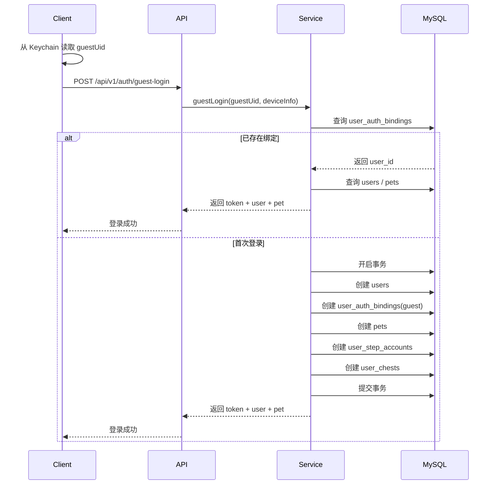

### 4.3 实现要点

- `guestUid` 由客户端首次安装时生成并存储在 Keychain
- 服务端必须保证同一 `guestUid` 只绑定到一个账号
- 初始化动作必须放到同一事务中，避免半初始化状态
- 若未来用户绑定微信，仍保留原 `user_id`

---

## 5. 首页加载流程

### 5.1 业务目标

用户完成登录后，首页应一次性拉到主界面所需的聚合数据，包括：

- 用户基础信息
- 当前宠物与穿戴信息
- 步数账户
- 当前宝箱状态
- 当前房间状态

### 5.2 时序图

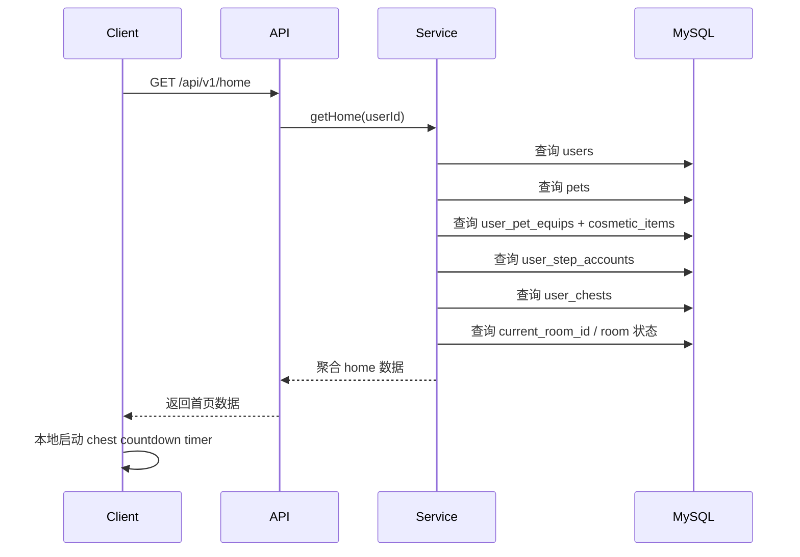

### 5.3 实现要点

- 首页接口应聚合返回，减少客户端多次请求
- 宝箱剩余秒数可由服务端直接返回，客户端仅负责显示倒计时
- 客户端本地倒计时结束时，可再次请求 `GET /api/v1/chest/current` 纠正状态

---

## 6. 步数同步流程

### 6.1 业务目标

客户端从 iPhone 系统读取当天累计步数后，定时同步给后端。后端按“当天累计步数差值”入账，而不是直接信任客户端增量。

### 6.2 推荐触发时机

- App 启动后进入首页
- App 回到前台
- 主界面停留期间定时同步
- 开箱前主动同步一次

### 6.3 时序图

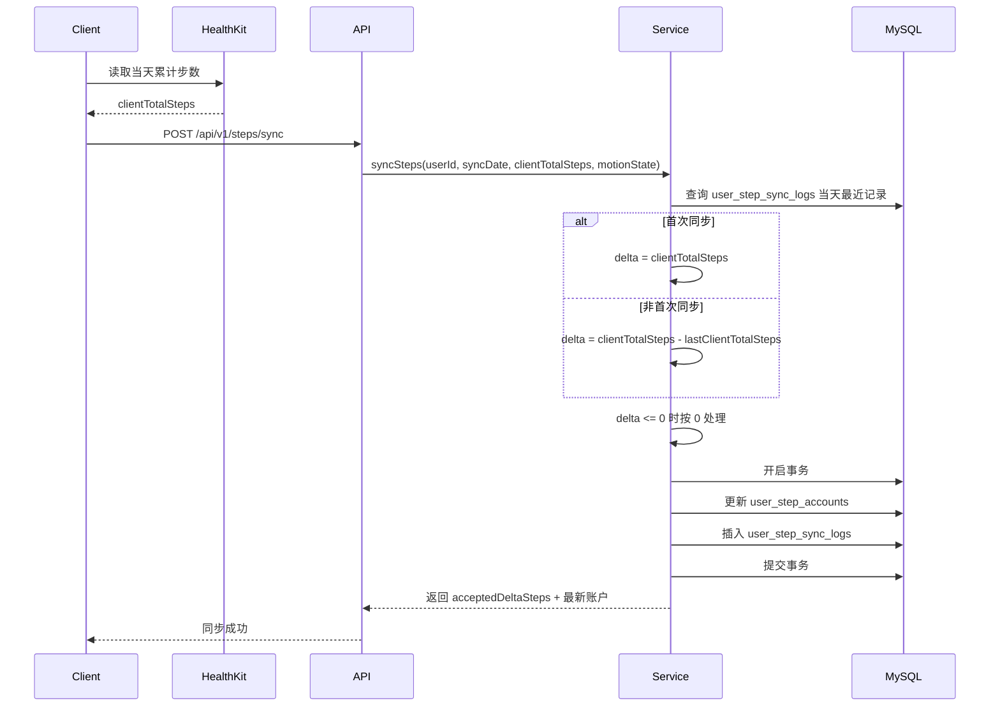

### 6.4 实现要点

- 服务端不要让客户端直接上报“新增了多少步”
- 服务端按自然日和最近同步记录计算差值
- 若客户端累计值回退或重复上报，增量按 0 处理
- `motionState` 主要用于展示与埋点，不建议直接参与资产记账

---

## 7. 宝箱状态流转

### 7.1 宝箱状态定义

当前只存在一个“当前宝箱”，状态如下：

- `counting`：倒计时中
- `unlockable`：可开启

### 7.2 状态流转图

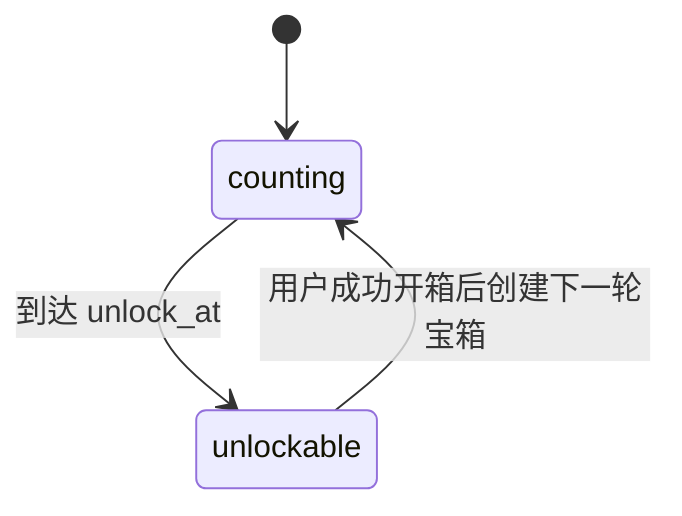

### 7.3 设计原则

- 用户同一时间只能有一个当前宝箱
- 倒计时到点后不需要后台定时任务主动改状态
- 服务端在读取宝箱时，可根据 `unlock_at <= now` 动态视为 `unlockable`
- 用户成功开箱后，再生成下一轮倒计时宝箱

---

## 8. 开箱流程

### 8.1 业务目标

用户在宝箱解锁后，消耗 1000 步开启宝箱，并获得一个新的装扮实例，同时立即开始下一轮宝箱倒计时。

### 8.2 推荐客户端调用顺序

- `POST /api/v1/steps/sync`
- `POST /api/v1/chest/open`

这样可以尽量确保开箱前步数已同步到后端。

### 8.3 时序图

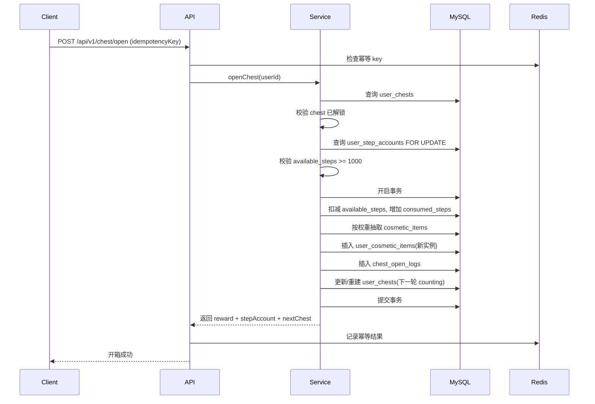

### 8.4 失败分支

可能失败的情况：

- 当前宝箱不存在
- 宝箱尚未解锁
- 可用步数不足 100
- 幂等冲突

### 8.5 实现要点

- 开箱必须是事务操作
- 奖励应创建为新的玩家道具实例
- 必须保留开箱日志，便于排查掉落问题
- 幂等键建议按用户 + 接口 + key 存在 Redis 中

---

## 9. 装扮穿戴流程

### 9.1 业务目标

用户从背包中选择一件具体装扮实例进行穿戴；若同部位已有旧装备，则自动卸下旧装备。

### 9.2 时序图

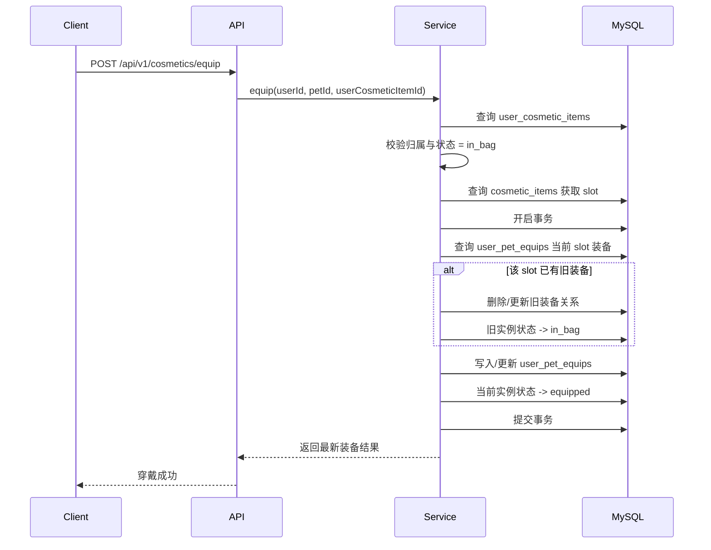

### 9.3 卸下流程

卸下流程与穿戴类似，但只需要：

- 删除 `user_pet_equips` 指定槽位关系
- 将实例状态从 `equipped` 改回 `in_bag`

### 9.4 实现要点

- 装备关系建议绑定到 `userCosmeticItemId`
- 这样后续无论是否出现同款多件实例，都能精确定位哪一件被装备

---

## 10. 合成流程

### 10.1 业务目标

用户手动选择 10 个道具实例作为材料，要求这 10 个实例品质一致，合成后得到 1 个更高一阶品质的随机装扮实例。

### 10.2 规则回顾

- 玩家必须手动选材料
- 必须恰好选择 10 个实例
- 这 10 个实例必须属于当前用户
- 这 10 个实例必须为背包状态 `in_bag`
- 这 10 个实例对应的装扮品质必须全部等于 `fromRarity`
- 不要求相同部位
- 不要求相同配置 id

### 10.3 时序图

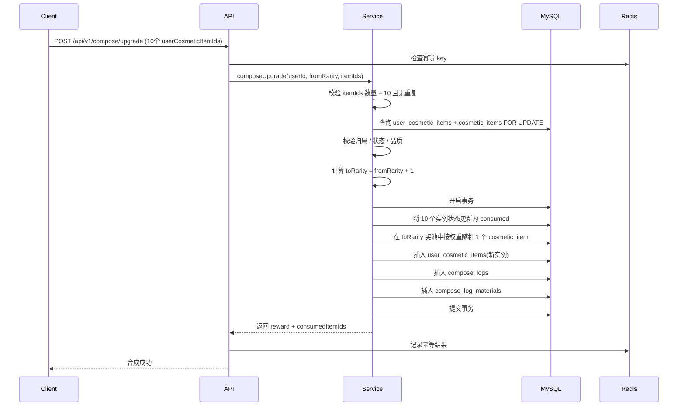

### 10.4 实现要点

- 合成必须显式记录消耗了哪 10 个实例
- `compose_log_materials` 建议直接记录 `user_cosmetic_item_id`
- 奖励道具同样以实例形式创建
- 若 `fromRarity = legendary`，则直接拒绝请求

---

## 11. 房间创建与加入流程

### 11.1 创建房间

#### 业务目标

用户当前未在任何房间时，可创建一个房间，并自动作为第一个成员加入。

#### 时序图

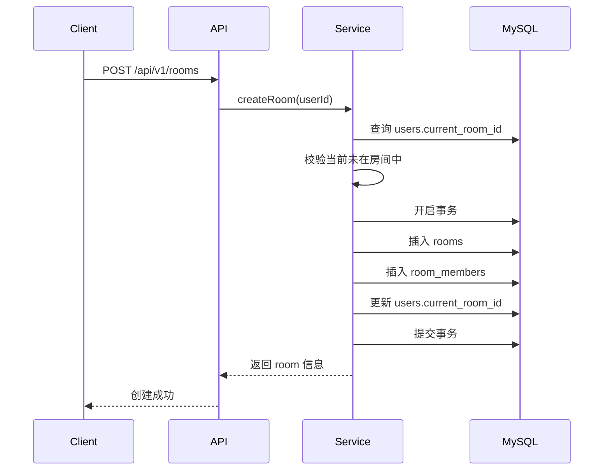

### 11.2 加入房间

#### 业务目标

用户加入已有房间时，需要校验该房间存在、未满员，且自己当前不在其他房间中。

#### 时序图

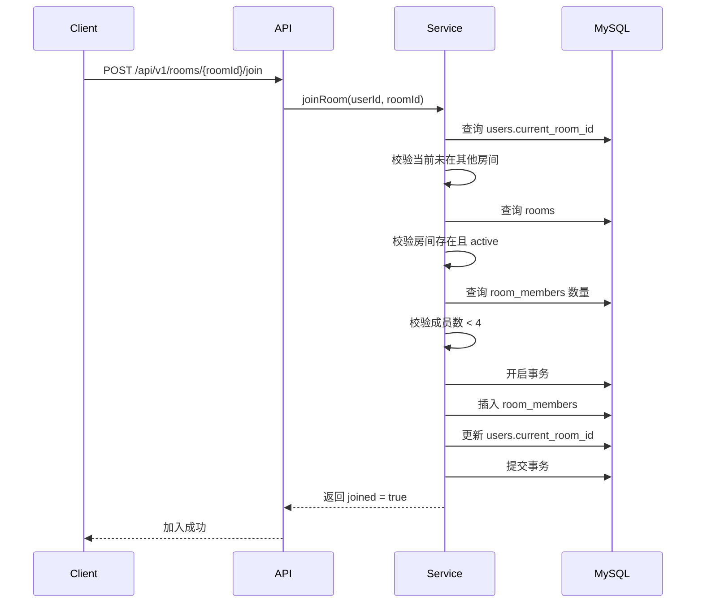

### 11.3 关键约束

- 一个用户同时只能在一个房间
- 一个房间最多 4 人
- 房间只要还有成员，就保持 active

---

## 12. 房间退出流程

### 12.1 业务目标

用户可主动退出当前房间。若退出后房间无人，则房间关闭。

### 12.2 时序图

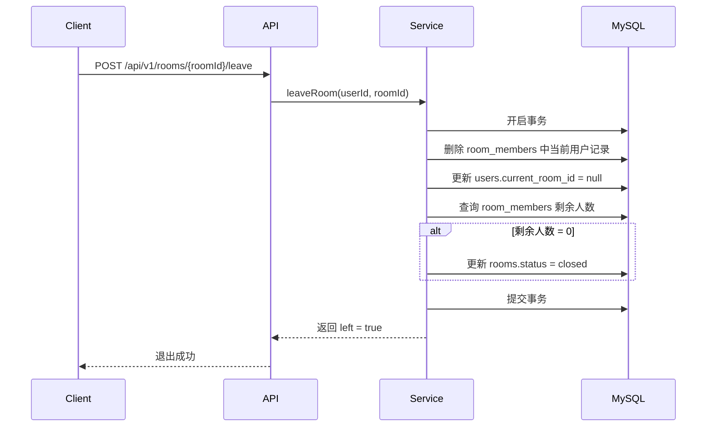

### 12.3 实现要点

- 房间无强管理权限，不存在“踢人”接口
- 房主退出后，房间依然可存在，只要还有其他成员
- 若未来需要房主转移，可在后续版本扩展

---

## 13. WebSocket 建连流程

### 13.1 业务目标

客户端在进入房间后建立 WebSocket 连接，用于：

- 获取房间快照
- 感知成员加入/退出
- 发送和接收表情广播
- 保持在线状态

### 13.2 时序图

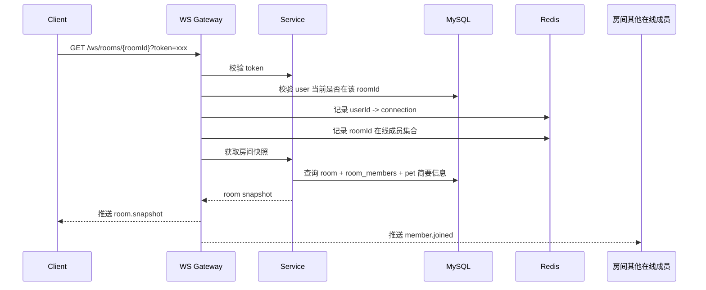

### 13.3 断连处理

当连接断开时：

- 从 Redis 清除连接映射
- 从房间在线集合移除当前用户
- 广播 `member.left` 给其他在线成员

注意：

- WebSocket 断开不等于用户退出房间
- 退出房间必须显式调用 HTTP `leave` 接口

---

## 14. 表情广播流程

### 14.1 业务目标

用户在房间内点击自己的猫，打开表情面板后，选择某个系统表情广播给房间其他用户。

### 14.2 时序图

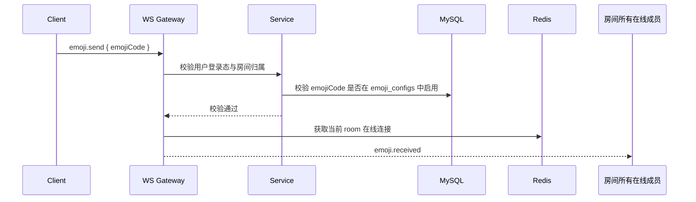

### 14.3 实现要点

- 表情只做广播提示，不落资产逻辑
- MVP 可不强制落库表情事件日志
- 若后续要做数据统计，可增加 `room_emoji_events`

---

## 15. 客户端关键页面推荐调用顺序

### 15.1 App 启动

1. 读取 `guestUid`
2. 调用 `POST /api/v1/auth/guest-login`
3. 调用 `GET /api/v1/home`

### 15.2 首页停留

1. 本地维护倒计时
2. 定时或关键节点调用 `POST /api/v1/steps/sync`
3. 倒计时到点后可调用 `GET /api/v1/chest/current`

### 15.3 开箱前

1. `POST /api/v1/steps/sync`
2. `POST /api/v1/chest/open`

### 15.4 进入装扮页

1. `GET /api/v1/cosmetics/inventory`
2. 选择实例后调用 `POST /api/v1/cosmetics/equip`

### 15.5 进入合成页

1. `GET /api/v1/compose/overview`
2. `GET /api/v1/cosmetics/inventory`
3. 手动选择 10 个实例
4. 调用 `POST /api/v1/compose/upgrade`

### 15.6 进入房间

1. `GET /api/v1/rooms/{roomId}`
2. 建立 WebSocket 连接
3. 收到 `room.snapshot`
4. 发送 / 接收表情广播

---

## 16. 关键一致性与边界说明

### 16.1 步数同步与开箱是分离链路

步数同步不是开箱接口内部自动做的逻辑，而是客户端应在开箱前主动调用同步接口。

这样做的好处：

- 职责清晰
- 开箱事务更纯粹
- 步数入账可独立追踪

### 16.2 房间成员关系与在线状态分离

- `room_members`：表示“属于该房间”
- Redis 在线集合：表示“当前 WebSocket 在线”

因此：

- 用户掉线，不代表离开房间
- 用户重新连接后，可恢复房间在线态

### 16.3 装扮实例状态必须与装备关系保持一致

若实例状态为 `equipped`，则理论上应存在对应 `user_pet_equips` 记录。

因此穿戴和卸下操作都必须通过事务维护两侧一致性。

---

## 17. 测试重点建议

### 17.1 游客登录

- 首次登录是否正确初始化所有基础数据
- 重复登录是否返回同一账号
- 绑定微信后是否保留原有数据

### 17.2 步数同步

- 当天首次同步
- 多次同步累计差值是否正确
- 客户端步数回退是否被正确处理为 0 增量

### 17.3 开箱

- 未解锁时是否禁止开箱
- 步数不足时是否失败
- 并发重复提交是否只成功一次
- 开箱后是否正确生成新实例与下一轮宝箱

### 17.4 合成

- 非 10 个材料是否失败
- 材料有重复 id 是否失败
- 材料不属于当前用户是否失败
- 材料品质不一致是否失败
- 已装备材料是否不能合成

### 17.5 房间

- 已在房间中再创建/加入是否失败
- 房间满 4 人是否禁止继续加入
- 用户掉线后是否仍保留房间成员关系
- 最后一人退出时房间是否关闭

---

## 18. 结论

当前版本的核心业务链路已经能够收敛为较稳定的实现方案：

- 登录链路以游客登录和可升级绑定为核心
- 步数链路采用“累计总步数差值入账”模式
- 宝箱链路采用“单当前宝箱 + 解锁后保留 + 开箱后重建”模式
- 装扮链路采用“实例化道具”模型
- 合成链路采用“手动选择 10 个同品质实例”模型
- 房间链路采用“HTTP 维护成员关系 + WebSocket 维护在线态”模式

这套流程足以支撑 MVP 实现，并与现有的总体架构、数据库设计、接口设计保持一致。
