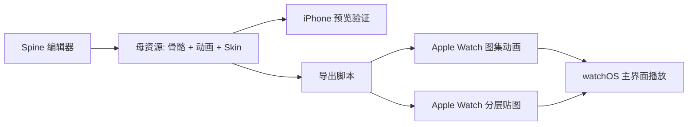

# Spine 到 Apple Watch 资源导出方案

## 目标

这套方案的目标不是让 Apple Watch 直接运行官方 Spine 渲染视图，而是：

- 用 Spine 作为母资源和动画编辑工具
- 在 iPhone / 编辑链路里预览和验证 Spine 动画
- 导出成适合 watchOS 的轻量资源
- 在 Apple Watch 上继续播放导出后的图集、分层贴图或 SpriteKit 资源

这样可以同时满足：

- 猫动画可持续迭代
- 换装能力可扩展
- Apple Watch 性能和功耗可控

## 为什么这样做

当前官方 `spine-ios` 可以在 iPhone 端播放，但不适合直接用于本项目的 watchOS 主界面渲染。

原因是官方显示层依赖：

- `UIKit`
- `UIViewRepresentable`
- `MTKView`

而 Apple Watch 端更适合：

- `SwiftUI`
- `SpriteKit`
- 轻量图片资源播放

所以最稳的架构是：

- Spine 负责“生产”
- Watch 负责“消费导出结果”

## 总体架构



## 推荐的两种导出形态

### 方案 A：导出图集动画

这是最适合当前项目的第一阶段方案。

做法：

- 在 Spine 中制作 `idle / walking / running / sleeping`
- 每个状态导出为固定帧数的 PNG 序列
- 再合并成状态图集
- Watch 端按状态循环播放对应帧

优点：

- 接近你当前 `default_cat_atlas` 的实现方式
- 接入成本最低
- 性能可预期
- 最适合先把主猫跑稳定

缺点：

- 换装组合会带来导出资源膨胀
- 如果衣服组合很多，图集数量会快速变大

适合：

- 第一版主猫动画
- 默认皮肤
- 少量完整套装

### 方案 B：导出分层贴图

这是更适合换装系统的长期方案。

做法：

- Spine 中继续用骨骼做动画
- 但导出时不只导出“整猫一张图”
- 而是按部位导出不同层

例如：

- `body`
- `face`
- `headwear`
- `outfit`
- `accessory`

然后 Watch 端按层叠加显示，并在状态切换时让每层同步切帧。

优点：

- 换装扩展性更强
- 套装和散件可以组合
- 奖励系统更自然

缺点：

- 客户端实现更复杂
- 要处理层级、锚点、遮挡顺序
- 资源规范要求更严格

适合：

- 真正的换装系统
- 衣柜系统
- 盲盒掉落组件化奖励

## 本项目推荐路线

建议分两阶段：

### 第一阶段

先做“整猫图集动画”：

- `idle`
- `walking`
- `running`
- `sleeping`

先把主猫、状态切换、奖励循环跑稳。

### 第二阶段

再升级为“分层导出 + 换装拼装”：

- 保留同一套 Spine 母资源
- 导出身体、衣服、帽子、配饰
- Watch 端按层组合播放

这样不会一开始就把美术流程和客户端复杂度拉满。

## Spine 母资源结构建议

建议在 Spine 中按下面的逻辑组织：

- `body`
- `eye`
- `mouth`
- `tail`
- `headwear`
- `outfit`
- `accessory_front`
- `accessory_back`

动画至少包含：

- `idle`
- `walk`
- `run`
- `sleep`

如果后面需要，也可以补：

- `yawn`
- `stretch`
- `celebrate`
- `touch_react`

## Skin 组织建议

建议分为两层：

### 基础 Skin

- `base_orange`
- `base_gray`
- `base_white`

### 装扮 Skin

- `hat_chef`
- `hat_frog`
- `outfit_strawberry`
- `outfit_apron`
- `accessory_bell`
- `accessory_bag`

最终可以在工具链里组合成：

- `base + hat + outfit + accessory`

这样既能保留 Spine 编辑灵活性，也方便导出。

## Apple Watch 资源目录建议

建议最终导出后在项目里按这套结构组织：

```text
ios/CatWatch/Resources/Art/
├── Atlas/
│   ├── Base/
│   │   ├── idle/
│   │   ├── walking/
│   │   ├── running/
│   │   └── sleeping/
│   ├── Outfit/
│   │   ├── strawberry/
│   │   ├── chef/
│   │   └── ...
│   ├── Headwear/
│   └── Accessory/
├── Metadata/
│   ├── atlas_manifest.json
│   └── skin_manifest.json
```

## 导出规格建议

### 分辨率

Watch 主猫建议按两档准备：

- 开发阶段：`256 x 256` 或 `384 x 384`
- 精修阶段：按机型和实际显示尺寸再调整

不建议一开始直接上特别大的资源。

### 帧数

建议先控制在：

- `idle`: 4 到 6 帧
- `walking`: 6 到 8 帧
- `running`: 6 到 8 帧
- `sleeping`: 4 到 6 帧

### 背景

- 透明 PNG

### 对齐规则

所有状态、所有层都必须：

- 使用同一画布尺寸
- 使用同一基准点
- 导出时位置不能漂

这是后续换装能不能稳定叠上的关键。

## Metadata 设计建议

建议给 Watch 端配一个 manifest，而不是让客户端猜资源名。

例如：

```json
{
  "states": ["idle", "walking", "running", "sleeping"],
  "layers": ["body", "headwear", "outfit", "accessory"],
  "frameCount": {
    "idle": 4,
    "walking": 6,
    "running": 6,
    "sleeping": 4
  },
  "skins": {
    "chef_hat": {
      "layer": "headwear"
    },
    "strawberry_apron": {
      "layer": "outfit"
    }
  }
}
```

这样后面切皮肤、播放状态时，Watch 端只按 manifest 走，不需要写死。

## Watch 端运行时建议

### 第一阶段运行时

继续沿用你现在已有的图集动画思路：

- 当前状态决定播放哪组帧
- 时间驱动切帧
- `walking / running / sleeping / idle` 直接切对应 atlas

### 第二阶段运行时

升级为分层播放：

- 每一层都根据当前状态切到对应帧
- 统一帧索引
- 层级固定叠加

例如：

- body walking frame 2
- hat walking frame 2
- outfit walking frame 2
- accessory walking frame 2

## 推荐的客户端分层

建议以后 Watch 端拆成：

- `CatAnimationRenderer`
  负责当前状态、当前帧索引
- `CatSkinComposer`
  负责当前装备组合
- `CatAssetManifest`
  负责读取导出 metadata
- `CatLayeredView`
  负责把各层图片叠起来

## 工具链建议

建议后面做一个简单导出脚本，职责是：

- 读取 Spine 导出结果
- 按状态切分
- 生成 watch 资源目录
- 输出 manifest

理想状态下，美术更新动画后，只要跑一次脚本，Watch 端资源就同步更新。

## 推荐开发顺序

1. 继续保留当前 watch 图集方案
2. 用 Spine 做一只默认猫的母资源
3. 在 iPhone 端验证 Spine 动画
4. 导出 `idle / walking / running / sleeping` 图集给 Watch
5. 把 Watch 端默认猫替换成由 Spine 导出的图集
6. 再做第一批可换装层：
   `headwear / outfit / accessory`
7. 最后接盲盒奖励和衣柜系统

## 一句话结论

对裤衩猫来说，最现实、最强扩展性的方案是：

**Spine 负责母资源和换装生产，Apple Watch 负责播放导出的轻量图集或分层贴图。**

这条路线既能保住 watch 端性能，也能把后面的换装系统做扎实。
