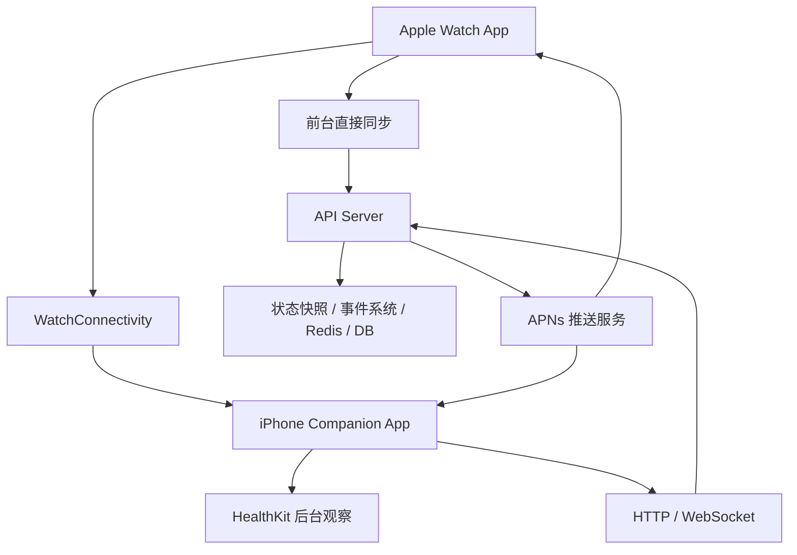

# 裤衩猫联机同步设计稿

## 1. 目标

本设计稿用于定义裤衩猫在 Apple Watch / iPhone / Server 三端之间的联机同步方式。

本项目的联机目标不是追求竞技级实时同步，而是实现以下体验：

- 用户在手表上可以看到多只好友小猫
- 好友小猫的状态看起来持续在线、持续有生命力
- walking / running 等关键状态能较快同步
- 触碰、奖励、盲盒等事件能及时感知
- 在 watchOS 后台限制下，整体架构仍然稳定、可上线、可扩展

因此，联机系统的设计原则是：

- 不依赖 Apple Watch 在后台持续实时长连
- 不依赖 Apple Watch 在后台持续监听并持续上传状态
- 采用前台实时同步 + 后台补同步 + 推送事件 + 服务端状态衰减的组合架构

## 2. 关键结论

### 2.1 Apple Watch 不能作为后台持续实时同步主节点

普通 watchOS App 在后台无法长期稳定运行，也不能假设持续监听运动状态并立即和服务器通讯。

因此：

- Watch 前台时可以直接同步状态
- Watch 后台时不能作为主同步引擎

### 2.2 iPhone 更适合作为后台同步协同节点

iPhone App 可以通过 HealthKit 后台能力，在系统允许的后台时机被唤醒，读取步数或运动数据变化，并和服务器通讯。

因此：

- Watch 负责本地体验与前台状态判断
- iPhone 负责后台补同步和更稳的网络通讯

### 2.3 服务器可以主动联系设备，但应通过 APNs

服务器主动联系设备的主方式是 APNs 推送，而不是和手表直接建立持续后台连接。

推送可以分为：

- 普通推送：有用户可见提醒
- 静默推送：用户无感，只用于低频后台刷新

但静默推送不能作为高频实时同步主通道。

### 2.4 好友猫联机应采用弱实时方案

裤衩猫不需要毫秒级实时联机。

好友猫系统更适合：

- 展示最近一次状态快照
- 通过更新时间和服务端规则进行状态衰减
- 通过触碰、奖励、盲盒、开始跑步等关键事件增强在线感

## 3. 推荐总体架构



## 4. 三端职责划分

### 4.1 Apple Watch 职责

- 本地判断自己的猫状态
- 前台实时展示自己的猫
- 前台上传自己的关键状态
- 前台拉取好友猫状态快照
- 接收服务器下发的事件结果
- 展示好友猫、盲盒、点数、触碰反馈

Apple Watch 重点负责：

- 本地体验
- 前台交互
- 前台同步

Apple Watch 不应承担：

- 长期后台实时联网
- 高频后台状态上传

### 4.2 iPhone 职责

- 使用 HealthKit 后台能力监听数据变化
- 在后台补同步 walking / running 等关键状态
- 与服务器进行更稳定的网络通讯
- 作为 WatchConnectivity 中转层
- 承担更复杂的认证、重试、缓存和状态修正

### 4.3 Server 职责

- 维护每个用户最新的猫状态快照
- 存储状态更新时间
- 对状态做衰减和离线判断
- 将好友状态聚合后返回给手表
- 下发重要事件推送

## 5. 同步方式分类

### 5.1 Watch 前台直连同步

适用于：

- 用户打开裤衩猫主界面时
- 手表进入多人同屏页时
- 用户有明确交互动作时

同步内容：

- 当前猫状态
- 点数变化
- 盲盒领取
- 皮肤 / 外观
- 触碰行为

推荐方式：

- `URLSession`
- 后期如果确实需要更强实时感，再评估短时 WebSocket

### 5.2 iPhone 后台补同步

适用于：

- 用户没有打开手表 App
- 但系统健康数据发生变化
- 需要后台补写 walking / running 状态

推荐方式：

- `HKObserverQuery`
- `enableBackgroundDelivery`
- 后台读取健康增量数据
- 与服务器进行状态同步

同步内容建议收敛为：

- `walking`
- `running`
- 可选的点数变化

`idle` 不建议高频上传，因为服务端可以推断。

### 5.3 Server 下行推送

适用于：

- 好友触碰
- 奖励事件
- 盲盒事件
- 关键状态刷新请求

推送分类：

- 有提示推送：用户可见
- 静默推送：用户无感，仅唤醒设备刷新

静默推送只适合低频场景，不适合高频实时状态广播。

## 6. 状态同步策略

### 6.1 建议同步的状态

建议服务端只维护主状态快照：

- `idle`
- `walking`
- `running`
- `sleeping`

不建议同步微行为：

- `microYawn`
- `microStretch`

微行为应只在本地播放，用于提升生命感，不进入服务端联机状态。

### 6.2 状态上行优先级

建议上行优先级如下：

1. `running`
2. `walking`
3. `sleeping`
4. `idle`

其中：

- `walking / running` 需要优先同步
- `sleeping` 可低频同步
- `idle` 可由服务端根据超时规则推断，不必频繁上传

### 6.3 推荐状态快照结构

```json
{
  "userId": "u_123",
  "catState": "walking",
  "points": 420,
  "skinId": "default_orange",
  "updatedAt": "2026-04-11T12:00:00Z",
  "source": "watch_foreground"
}
```

## 7. 服务端状态衰减策略

为了避免好友猫大部分时间都是旧数据，服务端需要做状态衰减。

推荐规则：

- `0 - 15 秒` 未更新：按真实状态显示
- `15 - 60 秒` 未更新：继续显示当前状态，但 UI 可适度弱化
- `1 - 5 分钟` 未更新：自动回落到 `idle`
- `5 分钟以上` 未更新：标记为静默 / 离线态

这样即使后台同步不连续，好友猫依然“看起来合理”。

## 8. 多人同屏展示建议

同屏四只猫时：

- 当前用户自己的猫：本地真实状态，实时刷新
- 其余三只好友猫：服务端状态快照

展示建议：

- 当前用户自己的猫优先保证真实
- 好友猫允许 10-60 秒级弱实时
- 通过动画插值和状态衰减维持在线感

## 9. 事件同步策略

相比连续状态，同步“事件”更容易形成在线感。

建议重点做以下事件同步：

- 好友触碰
- 好友开始跑步
- 好友领取盲盒
- 好友获得奖励

这些事件可以：

- 直接写入服务端事件流
- 必要时通过 APNs 下发
- 在手表端做震动和轻提示

## 10. 点数与盲盒同步建议

当前项目已经采用“步数转点数、点数兑换盲盒”的模型。

建议同步方式如下：

- 点数总量：可与状态快照一起同步
- 盲盒掉落：客户端本地驱动
- 盲盒领取：必须写入服务端
- 盲盒奖励：服务端确认后返回结果

这样可以避免：

- 多端重复领取
- 客户端作弊
- 点数不一致

## 11. 推荐落地方案

### 第一阶段

- Watch 前台直接同步
- iPhone 后台补同步 walking / running
- 服务端保存状态快照
- 好友猫按状态快照显示
- 关键事件先走普通推送

### 第二阶段

- 增加静默推送做低频刷新
- 完善服务端状态衰减
- 加入触碰事件流
- 多人同屏支持更稳定的好友状态更新

### 第三阶段

- 如果实时需求确实提高，再评估短时 WebSocket
- 评估更复杂的前台联机房间机制
- 但仍不建议依赖 Apple Watch 后台持续长连

## 12. 最终结论

裤衩猫联机最适合的不是“纯实时后台同步”，而是：

- Watch 前台实时
- iPhone 后台补同步
- Server 存快照
- APNs 传事件
- 好友猫状态做衰减显示

这套方案最符合：

- watchOS 的系统限制
- 产品的轻社交定位
- 多人同屏的真实可落地性

它不是最理想化的“绝对实时”，但会是最稳定、最像真实产品、也最有机会做成的方案。
