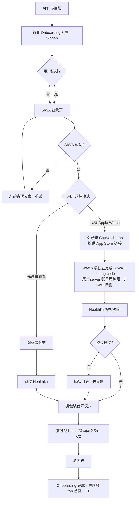
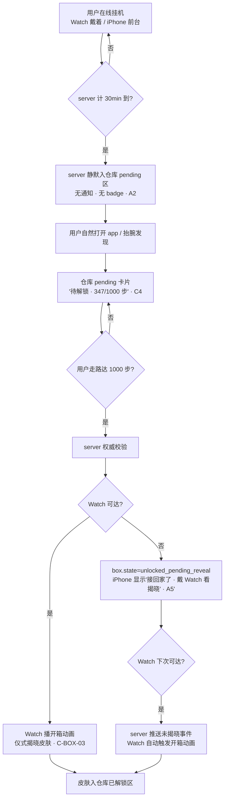

---
stepsCompleted:
  - step-01-init
  - step-02-discovery
  - step-03-core-experience
  - step-04-emotional-response
  - step-05-inspiration
  - step-06-design-system
  - step-07-defining-experience
  - step-08-visual-foundation
  - step-09-design-directions
  - step-10-user-journeys
  - step-11-component-strategy
  - step-12-ux-patterns
  - step-13-responsive-accessibility
  - step-14-complete
completedAt: 2026-04-20
workflowStatus: complete
decisions:
  defaultTab: account
  darkMode: false
  myCatBreathingAnimation: true
  myCatLookUpOnLaunch: true
  failClosedCopyTone: humanized-gentle
  digitalTouchPositioning: silent-no-mention
  finchBorrowing: ux-only-not-marketing
  tapbackAdaptation: mechanic-yes-visual-diff
  defininingExperienceVersion: v0.3-after-party-mode
  singleEntryCardAsButton: true
  emojiPickerAdaptive: y-coordinate-60pct-triggers-sheet
  mvpEmojis: [heart, sun, sleep]  # ❤️ 比心 / ☀️ 晒太阳 / 😴 困意
  microReactionTemplates: 3  # 歪头 / 抬爪 / 哈欠
  microReactionDispatchMode: random-decoupled-from-emoji  # 护城河关键
  microReactionScope: all-scenarios  # C3 修订：扩展到房间内也做
  iphoneSpineRuntime: forbidden  # 帧序列 PNG 或 Lottie 交付
  croom02FailMode: fail-open  # 叙事流降级为加分项，本地反馈是心理兜底
  counterVisibility: zero  # 禁止累计数据可见
  croom02Language: pet-narrative-only  # 禁 Slack 词汇
  tooltipFrequency: first-time-only  # 只首次 1 次
  tooltipCopy: "它摆了摆尾巴"
  emojiFloatCurve: float-not-jump  # 0.25-0.3s ease-out / 8-12pt / no overshoot / ±2pt drift
  breathingDecayDuringInteraction: 30pct
  # Step 10 Party Mode 19 条决策
  architecturePhilosophy: server-centric-wc-optional  # 哲学 B
  onboardingTerminatesAt: naming-cat  # C1 · 首次发表情推出 onboarding
  catGazeOnboardingAnimation: lottie-2.5s  # C2
  boxDropNotification: none  # A2 · 旅行青蛙式纯发现制
  boxDropBadge: none  # A2 完全无 badge
  boxUnlockRevealDevice: watch-only  # A5 · iPhone 不接管开箱动画
  boxUnlockPendingRevealState: true  # A5 · Watch 不可达时延迟揭晓
  firstTimeExperienceTracker: server-user-milestones  # A3
  emoteDeliveredEventToClient: false  # A4 · 违反 fire-and-forget 拒绝
  failNodeACFormat: triplet-timeout-ui-metric  # B1
  e9Nodes: [watch-first-unbox-haptic, observer-room-watch-haptic]  # B2
  testFixtureSuite: [user-defaults-sandbox, ws-fake-server, haptic-spy]  # B3
  assertionStyle: state-based-not-time-based  # B4
  edgeCaseMinimumPerFlow: 3  # B5
  boxWalkProgressUI: numerical  # C4 · MVP 简单数字进度
  inventoryLayout: lazy-vgrid  # C5 · 表格布局（非明信片错落）
  craftConfirmationUI: traditional-sheet  # C5 · 传统 Sheet
  craftButtonLabel: "换一条"  # C6 · 改自工业词"合成"
  geometryReaderDiscipline: inside-card-only-no-scroll-root  # D1
  craftAnimationConcurrency: parallel-with-500ms-timeout  # D2
  timeoutConfig: centralized-CatShared-Configuration  # D3
inputDocuments:
  - /Users/zhuming/fork/catc/ios/CatPhone/_bmad-output/planning-artifacts/prd.md
  - /Users/zhuming/fork/catc/ios/CatPhone/_bmad-output/project-context.md
  - /Users/zhuming/fork/catc/CLAUDE.md
  - /Users/zhuming/fork/catc/裤衩猫.md
  - /Users/zhuming/fork/catc/docs/backend-architecture-guide.md
  - /Users/zhuming/fork/catc/docs/api/openapi.yaml
  - /Users/zhuming/fork/catc/docs/api/ws-message-registry.md
  - /Users/zhuming/fork/catc/docs/api/integration-mvp-client-guide.md
workflowStatus: in_progress
startedAt: 2026-04-20
---

# UX Design Specification - CatPhone

**Author:** Developer
**Date:** 2026-04-20

---

<!-- UX design content will be appended sequentially through collaborative workflow steps -->

## Executive Summary

### Project Vision

CatPhone（裤衩猫 iPhone 端）定位为 Watch-first 陪伴宠物体验的**配件端 + 观察者降级端 + 深度管理端**——而非独立 app。为"久坐却拒绝被自律 KPI 审判"的年轻人（程序员/设计师/学生 + 萌系陪伴爱好者 + 异地情侣/密友）造一个"思念的口袋窗户"，把走路从"健康压力"反转为"接猫回家"的浪漫。北极星指标：D30 用户日均抬表互动次数 × D30 平均好友数（两项单独做不出数据 = 护城河失败）。

### Target Users

- **核心用户（Watch + iPhone 双端）**：28±5 岁程序员/设计师/文字工作者/学生；久坐 2+ 小时不起身是日常；讨厌健身圆环压力；对"审美敏感 · 懒惰的收集癖 · 触觉社交"三词自认
- **护城河燃料（iPhone-only 观察者）**：情感驱动 > 健身驱动的年轻人；看朋友猫状态 + 发表情权限对等 Watch 用户，但不领奖/不解锁；D30 内 25% 转为完整用户为健康指标
- **爆火圈层**：异地情侣 / 密友 / 办公室搭子——需要"弱提醒、强感知"的不打扰亲密频道

### Key Design Challenges

1. **"配件端而非阉割版"的哲学贯彻**：iPhone 不渲染猫动画、不剧透盲盒、不做实时挂机，但必须有独立价值（大屏慢浏览 / 深度编辑 / 叙事文字流）
2. **观察者模式的"对等但不对等"语义**：发表情权限对等 / 隐私 gate 数据不对等——UI 传达温柔不伤害
3. **"温柔门槛"文案纪律**：每处都不能让用户感觉欠债（"接猫回家" / "材料入库" / "已达成·等待确认"）
4. **情绪层已移除**：猫只做 walk/sleep/idle 物理动作同步，不做 hungry/sad/happy 情绪机——UI 保持"反馈回路"而非"情绪包袱"
5. **Fail-closed 状态的温柔化**：`/v1/platform/ws-registry` 启动失败屏蔽主功能——温柔叙事 vs 冷漠报错
6. **色盲无障碍硬约束**：皮肤颜色分级必须配合形状或文字标签
7. **Spine 渲染 Watch 独占**：iPhone "我的猫" 卡片静态 avatar 如何不死板
8. **推送剧透规避**：iPhone push 不含皮肤名，保留 Watch "抬表揭晓"仪式感

### Design Opportunities

1. **iPhone = 情感的"慢房间"**：Watch 是抬腕瞬间，iPhone 是睡前翻仓库的时刻——互补而非竞争
2. **叙事文案引擎**（`C-ROOM-02`）：房间 tab 无动画，但有温柔时态叙事（"小林的猫刚刚睡着了 · 2min 前"）
3. **观察者 → 完整用户 的温柔转化路径**：J2 小雨叙事提供的 UX 暗示时机（不硬推买表）
4. **装扮 = iPhone 独占"大屏慢时刻"**：Watch 是 payoff 剧场，iPhone 是试衣间
5. **5 个空状态 = 5 段温柔开场白**（`C-UX-03`）：仓库 / 好友 / 房间 / 皮肤合成 / 首开各自的叙事入口
6. **SwiftUI iOS 17 原生语言**：`ContentUnavailableView` + Dynamic Type + SF Symbols + 温柔中文文案 = Apple 原生优雅衬托情感叙事

## Core User Experience

### Defining Experience

**核心用户动作 = "触达自己的猫"**。iPhone 唯一真正替代 Watch 的操作——Watch 直接点猫本体，iPhone 点账号 tab 首屏的"我的猫"卡片（静态 avatar + 轻微呼吸动画 + 发表情按钮）。贯穿所有 persona：小林随手（J1-S9）、小雨观察者核心（J2-S5）、孤独首开兜底（J5-S5）、房间 fan-out 社交（J3-S7）。对应 `C-ME-01` + `C-SOC-01` + FR26/27/28/29/30。

**次核心动作**：仓库慢浏览 + 装扮编辑（iPhone 大屏独占"试衣间时刻"）；房间叙事文字流（被动阅读，`C-ROOM-02`）。

### Platform Strategy

- Native iOS 17+ SwiftUI（XcodeGen / 不跨平台 / 不 RN/Flutter）
- iPhone 纵向；单手握持优先（底部 5-tab TabBar 在拇指弧形范围）
- **5-tab 已锁 + 默认进账号 tab**（"我的猫"卡片 = 首屏情感锚点）
  - 账号（首） / 好友 / 仓库 / 装扮 / 房间
- **浅色 only MVP**，深色模式推 Growth；Asset 不预留双套（避免过早抽象）
- 中文硬编码 MVP；国际化推 Growth epic
- 离线三档：完全离线 / WS 断 / `ws-registry` 失败（fail-closed）
- 推送分频道：盲盒 / 好友 / 表情 独立；久坐召唤 iPhone 不发 push（Watch haptic 独占）

### Effortless Interactions

1. **打开 app ≤ 1 次点击看见自己的猫**（默认账号 tab = 首屏）
2. **发表情 ≤ 2 次点击**（无确认弹窗，fire-and-forget 无"已送达"）
3. **仓库大屏无分页/搜索**（LazyVGrid 颜色分组一屏下拉）
4. **装扮换装无"保存"按钮**（点/拖即生效，`@Observable` + server sync）
5. **好友邀请 one-tap accept**（无填表无分组）
6. **房间叙事流 WS 自动刷新**（无下拉刷新手势）
7. **HealthKit 授权延迟请求**（首次进仓库/步数展示时再弹）

### Critical Success Moments

1. **首屏 2 秒内看见自己的猫**（情感锚点 + J5 孤独兜底；呼吸动画让"静止"活着）
2. **撕包装首开仪式 + 命名猫**（`C-UX-02` / FR7，形成拥有感）
3. **观察者首次发表情**（J2-S5，"陪伴不需要观众"语义兑现）
4. **首次接受好友邀请进房间**（J2-S6，跃迁到"在场"）
5. **首次看到房间叙事文字流**（"[好友]的猫刚刚睡着了"，iPhone 独占文字诗意）
6. **步数 "—" 降级不尴尬**（J4-S6，HealthKit 拒绝可恢复引导）
7. **fail-closed 温柔文案**（`ws-registry` 启动失败硬合规，不冷漠）

### Experience Principles

1. **抬腕是剧场，口袋是慢房间** —— iPhone 永不抢 Watch 仪式；提供"翻阅 / 试穿 / 重温"慢时刻，不做实时挂机 / 盲盒剧透 / 猫动画（但"我的猫"卡片呼吸动画例外——极轻微 Core Animation，非 Spine，只为让静止显生命）
2. **温柔门槛 · 零欠债文案** —— 每处叙事向"接猫回家"方向拉；"已达成·等待确认"要等不要催
3. **对等权限 · 降级尊重** —— 观察者能做的做到最好（发表情权限对等 Watch），不能做的温柔解释
4. **反馈是回路 · 不是情绪包袱** —— 猫只做 walk/sleep/idle 物理动作同步，UI 不引入 Tamagotchi guilt
5. **空状态皆开场白** —— 所有空态都是温柔叙事入口，不是"暂无数据"冷漠

### Locked Decisions (v0.1)

| 决策 | 选择 | 原因 |
|---|---|---|
| **默认打开 tab** | 账号 tab | "我的猫"卡片 = iPhone 核心情感锚点，触达自己的猫 = 核心动作 |
| **深色模式** | MVP 不做 | 聚焦浅色调优；深色 + 纹理双套资产成本 vs 收益偏低，推 Growth |
| **"我的猫" avatar 动画** | 轻微呼吸动画 + 打开 app 触发一次"抬眼看你" | 完全静止显冷；Core Animation / SwiftUI `withAnimation` 驱动（非 Spine，单向兼容 iPhone 不依赖 Watch 渲染栈） |

## Desired Emotional Response

### Primary Emotional Goals

iPhone 端应让用户感觉（基于 PRD 灵魂句"**你走到它身边时，刚好抬头看你的猫**"反推）：

1. **温柔的被期待感** —— "猫在家等我"，不是"我欠它"（与 Tamagotchi 情绪机彻底划清）
2. **慢时刻的诗意** —— 睡前翻仓库、早上配装扮的不焦虑慢节奏（iPhone 独占心境）
3. **触达的确定感** —— 即使无人看见也"猫听到我了"（J2-S5 陪伴兜底）
4. **不打扰的在场感** —— 看见朋友状态有在场感但不被骚扰（微信反面）
5. **收藏癖的小确幸** —— 翻仓库看今天接回家的皮肤（"懒惰的收集癖"击中点）

### Emotions to Avoid (Anti-List)

1. **Guilt / 欠债感** —— "你没走够 / 它饿了 / 你忘了"（PRD 移除情绪机根源于此）
2. **FOMO / 催促** —— 进度焦虑、"朋友都开了 5 盒"、连胜断裂
3. **阉割版的憋闷** —— 观察者 iPhone-only 用户不能感觉"我是残次品"
4. **冷漠的报错** —— fail-closed / HealthKit 拒绝 / 网络异常的技术语
5. **亲密的负担** —— 表情"已读"/ 回复债 / "你还没回"
6. **过度游戏化** —— 烟花动画 / 关卡编号 / 成就音效
7. **一切感叹号的催促/抱歉** —— "抱歉重复！" / "快来签到！"

### Emotional Journey Mapping

| 阶段 | 期望情绪 | 必避情绪 |
|---|---|---|
| 首次发现 | 好奇 + Slogan 触动 | 被自律类 app 套路 |
| 叙事 Onboarding 3 屏 | 期待 + 温柔启动 | 问卷压力 / 强制注册冲击 |
| 撕包装命名猫 | 仪式 + 拥有感 | "跳过"显眼 / 步骤冗长 |
| 首次见自己的猫 | 心软 + 抬头一笑 | 冷感（呼吸 + 抬眼动画兜底） |
| 首次发表情（无人看见） | 触达确定 + 陪伴兜底 | 沮丧（无人看见 ≠ 没发出去） |
| 收到好友表情震动 | 被悄悄记挂的温暖 | 骚扰（静音选项兜底） |
| 接猫回家（解锁盲盒） | 温柔门槛 + 小确幸 | "终于达标"累感 |
| 晚上翻仓库 | 收藏的小富足 | 进度压力 / 集齐焦虑 |
| 装扮编辑 | 自我表达 + 挑衣服 | 功能迷宫 / 保存按钮焦虑 |
| 失败态（网/授权/fail-closed） | 可恢复 + 温柔指引 | 技术报错 / 挫败 |
| 孤独首开（无好友） | 陪伴兜底 + "陪伴不需要观众" | "快去加好友！"逼迫 |
| 重开（D2/D7/D30） | "它还在等我" | 签到/连胜负担 |
| 观察者→完整用户 | 想被朋友也悄悄想起 | 买 Watch 推销压迫 |

### Micro-Emotions

| 微情绪 | 必须（+） | 必避（-） | 承载设计 |
|---|---|---|---|
| Trust | 数据被尊重 | 数据焦虑 | 隐私政策入口 + 透明文案 |
| Confidence | 发出即完成 | 回复债 | fire-and-forget 无"已送达" UI |
| Belonging | 在场但不打扰 | IM 式追问压力 | 叙事文字流无 toast |
| Delight | 撕包装 + 稀有跃迁 | 庆祝烟花 / 音效 | 小动作 + 低饱和色 |
| Anticipation | 温柔等 | 焦虑 spinner | 骨架屏 + 缓动曲线 |
| Calm | 基调不尖锐 | 红点 / 未读 / 徽章 | 通知克制 + 色系低饱和 |

### Design Implications (情感 → UX 决策)

| 情感目标 | UX 设计选择 |
|---|---|
| 温柔被期待感 | 第二人称温柔文案（"你的猫"）；静态 avatar + 呼吸动画 + 打开 app 触发一次"抬眼看你"（0.6s 单次，SwiftUI withAnimation） |
| 慢时刻诗意 | 过渡动画偏缓（0.3–0.5s ease）；大留白；低饱和色；骨架屏替代 spinner |
| 触达确定感 | 点卡片 → emoji **本地立即浮出**（不等 server ack），浮出曲线缓出缓消（约 2s 生命周期） |
| 不打扰在场感 | 房间流不弹 toast；推送默认静音（无声 banner）；时态模糊化（"刚刚 / 2min 前 / 半小时前"） |
| 收藏小确幸 | 仓库 LazyVGrid 温柔呈现；稀有度色低饱和；合成进度"蓝色 × 3 / 5 可合成绿色"句式（无百分比进度条） |
| 避免欠债 | 零否定词文案纪律 —— "材料入库" vs "重复"；"接猫回家" vs "消耗步数"；"已达成·等待确认" vs "待服务器同步" |
| 避免阉割感 | 观察者模式文案温柔（禁用词："降级 / 限制 / 不支持 / 无权限"；改用"在这个设备上 / 和 Watch 用户一样能发表情"） |
| 避免冷漠报错（人性化方向） | fail-closed 人话拟人文案 —— `ws-registry` 失败："网络累了，先歇一歇，过会儿再试"；HealthKit 拒绝："我们只看步数，别的不看，要不要再开一下？" |
| 避免过度游戏化 | 无烟花 / 无音效 / 无关卡编号；所有"获得"改为"来了 / 入库" |
| 观察者温柔转化 | J2 式叙事——不硬推"买 Watch"；首次进房间后温柔一行字"有 Watch 的朋友会在抬表时听到你的心 ♡"（可关闭） |

### Emotional Design Principles (6 条)

1. **温柔不怂** —— 文案永远温柔但不软弱（fail-closed 是硬合规，也可以温柔说）
2. **被动多于主动** —— 情绪由"发现"产生（打开看见猫；刚好看见朋友状态），不是 app 主动推给你
3. **留白即呼吸** —— UI 空间 / 动画节奏 / 推送频次都留白；不塞满屏幕
4. **小确幸非大庆典** —— 皮肤获得、合成成功、邀请接受都用小动作反馈，不做烟花 / 音效
5. **失败态也温柔** —— 错误态用人话不用技术词；fail-closed 永远有去处（重试 / 去设置）
6. **陪伴不争宠** —— iPhone 不喊"快来看我"；猫不做 guilt 动作；推送不剧透 Watch "抬表揭晓"仪式

### Copywriting Register (文案基调)

- **人称**：第二人称（"你 / 你的猫"），避免"我 / 本 app"
- **拟人度**：**温柔拟人偏高**（文案可以代猫/app 说话："先歇一歇" / "猫给你留着呢"），但**不卖萌不撒娇**
- **叹号**：整个 app **禁用 "!"**（中文感叹号 / 英文 exclamation 都禁，除非用户自己输入）
- **否定词黑名单**：抱歉 / 失败 / 错误 / 重复 / 无法 / 禁止 / 未满足 / 不够 —— 全部转正向句式
- **失败态 fallback 句式模板**（候选，后续 Story 确认）：
  - 网络类："网络累了，先歇一歇，过会儿再试"
  - 授权类："我们只看步数，别的不看，要不要再开一下？"
  - 不匹配/冲突类："这个暂时没办法哦，换个试试？"
  - 数据不一致态（盲盒已达成等 server）："已达成·等待确认"（PRD 钉死，不改）

### Locked Decisions (v0.1 延续)

| 决策 | 选择 | 原因 |
|---|---|---|
| **"猫抬眼看你"微动画** | 打开 app 触发一次 | 纯静态呼吸显冷；抬眼瞬间 = 灵魂句的 UI 兑现（"刚好抬头看你"），0.6s 单次非循环避免廉价 |
| **fail-closed 文案语气** | 温柔拟人偏高 | 用户选择"人性化"；硬合规但不冷漠，从情感护城河做到底 |

## UX Pattern Analysis & Inspiration

### Inspiring Products Analysis (5 Core References)

筛选原则：**突出温情**——所有参考都朝"温柔 / 慢 / 不打扰 / Apple 原生优雅"方向收敛。

| App | 学什么 | 用在哪 |
|---|---|---|
| **Finch**（自护理宠物 app） | 温柔拟人文案范式；"每日成长"不强制；companion 的零 guilt 表达 | 文案基调（"先歇一歇"类拟人失败态）+ 猫的"不打扰式陪伴"情绪定位 |
| **旅行青蛙（旅かえる）** | 日式低压力陪伴；明信片 / 相册诗意；无时限无 KPI | 仓库 tab 皮肤陈列（叙事式非货架式）+ 房间文字流"不在时"时态 |
| **Apple Journaling（iOS 17.2+）** | 第二人称温柔文案（"Today you..."）；建议式提示不强推；骨架屏节奏 | Onboarding 文案模板 / 空状态 / 房间叙事句式 |
| **iMessage Tapback** | one-tap 情绪反馈（点选即完成，无回复债） | "我的猫"卡片发表情选单机制 |
| **AutoSleep / Gentler Streak** | iPhone = 数据慢浏览 + 历史图表；Watch = 实时反馈；分工清晰互补 | iPhone vs Watch "抬腕剧场 / 口袋慢房间"分工哲学 |

**视觉基调补充参考**：
- **Bear Notes / Day One** —— 单列文字流美学，无装饰干扰
- **泡泡玛特官方 app** —— 盲盒陈列色彩分级（改造为低饱和温柔版）
- **Apple Weather（iOS 17 重设计）** —— SF Symbols + 半透明卡片 + 大字号层级

### Transferable UX Patterns

| 维度 | 迁移模式 | 用在哪 |
|---|---|---|
| **Navigation** | iOS 原生 TabView + NavigationStack（iMessage / Journaling 标准） | 5-tab 骨架 + 各 tab 栈式导航 |
| **Interaction** | Tapback 式发表情（点 → 弹 → 点选 → 即发 fire-and-forget） | "我的猫"卡片表情选单（机制同，视觉差异化） |
| **Content** | Bear 式单列文字流（无头像 / 无气泡 / 无装饰） | 房间叙事文字流（"[好友]的猫刚刚睡着了"） |
| **State** | Journaling 式骨架屏（替代 spinner，低焦虑） | 所有加载态 / 等待态 |
| **Delight** | Finch 式拟人失败态文案 | 所有 error / fail-closed / 权限拒绝场景 |
| **Rhythm** | 旅行青蛙"不在时"叙事节奏 | 时态模糊化（"刚刚 / 2min 前 / 半小时前 / 今天早些时候"） |

### Anti-Patterns to Avoid

| 反模式 | 来源 | 冲突点 |
|---|---|---|
| **连胜 / 签到 guilt** | Duolingo / Keep / 支付宝步数 | 违反"温柔门槛"；PRD 已删日历签到正是此理 |
| **圆环合拢审判** | Apple Fitness 默认 UX | 我们用户正是被它逼麻木的群体（J1 opening） |
| **抽卡仪式感 + 概率公示** | 原神 / 崩铁 / 泡泡玛特开盒动画 | 盲盒仪式归 Watch（`C-BOX-03`）且极简；iPhone 不剧透 |
| **高频人对人触觉** | Apple Digital Touch（已下线） | 市场证伪；我们用"宠物代言人"语义解套（猫发表情 ≠ 人发心） |
| **已读回执 + 回复债** | 微信 / iMessage 已读 | 与 fire-and-forget + "不打扰的亲密"直接冲突 |
| **烟花庆祝 + 音效奖励** | Duolingo 完成课 / 支付宝开红包 | 与"小确幸非大庆典"冲突；廉价化陪伴 |

### Design Inspiration Strategy

**Adopt（直接采用，不做大改）**：
- **iMessage Tapback** 式 one-tap 机制（最少步骤 + 无确认弹窗 + 无回复债）
- **Apple Journaling** 第二人称温柔文案模板（"你..." "你的猫..."）
- **Finch** 拟人失败态文案（对齐人性化 fail-closed 决策）
- **旅行青蛙**"不在时"叙事机制（时态模糊化）
- **SF Symbols 2+ 风格** + `ContentUnavailableView` 原语（Apple 原生温柔范式）

**Adapt（改造后用）**：
- **AutoSleep iPhone/Watch 分工** → "Watch 剧场 / iPhone 慢房间"（Watch 跑实时动画，iPhone 跑历史 / 装扮 / 文字流）
- **泡泡玛特货架陈列** → 低饱和温柔版（白 < 灰 < 蓝 < 绿 < 紫 < 橙，饱和度 60–70%）
- **Bear 文字流美学** → 房间叙事（单列纯文字 + 时态模糊化，无头像无气泡）
- **Tapback 机制（保留）+ 视觉差异化**：机制 = one-tap 点即发（零学习成本）；视觉 ≠ iMessage 彩色气泡——改为**温柔 emoji 浮在猫旁边**（缓出缓消 ~2s，低饱和色），形成"熟悉但不一样"的微惊喜

**Avoid（明确反模式）**：
- 上述 6 条 anti-patterns
- 全 app 禁感叹号（`!` / `！`）
- 否定词黑名单：抱歉 / 失败 / 错误 / 重复 / 无法 / 禁止 / 未满足 / 不够 —— 全部转正向句式

### Positioning Boundaries (温情路线的划界)

| 维度 | 决策 | 原因 |
|---|---|---|
| **Digital Touch 对比** | 低调不提（不主动划清） | 主动划清反而让人联想；专注讲自己"猫代言人"的故事 |
| **Finch 借鉴尺度** | UX 层借鉴（文案 / 陪伴定位），营销层不碰"情绪管理 / 焦虑治疗" | 我们是"陪伴 + 亲密"不是"情绪治疗"；避免被错类 |
| **Tapback 模仿度** | 机制借用（one-tap），视觉差异化（emoji 浮猫旁 ≠ 彩色气泡） | 零学习成本 + 独特温情视觉 = "熟悉但不一样"的微惊喜 |

## Design System Foundation

### Design System Choice

**Apple HIG + SwiftUI 原生 + Cat 品牌薄封装层**（Option 4）—— **骨架用原生，温度靠令牌**。

### Rationale for Selection

1. SwiftUI + iOS 17 已钉死（`project.yml` / `CLAUDE.md`）——无其他平台选项
2. "不引过度依赖"纪律（`PCT-arch`）——排除第三方 SwiftUI 库
3. 1–2 人团队规模不支持完全自建设计系统
4. 纯 Apple HIG 默认偏理性冷感，无法承载温情叙事——需要薄薄一层品牌令牌 + 业务组件
5. 薄封装便于 PR review + 易于后续 tuning / 国际化 epic

### Implementation Approach

- **Tokens**：单文件 `CatShared/Resources/DesignTokens.swift`（色 / 字 / 间距 / 圆角 / 动画 / 时长）
- **跨端共用 UI**：`CatShared/Sources/CatShared/UI/`（`MyCatCard` / `SkinRarityBadge` / `StoryLine` / `EmptyStoryPrompt` / `GentleFailView` / `EmojiEmitView`）
- **Feature 组件**：`CatPhone/Features/<Feature>/` 按需组装，基于原生 + tokens
- **依赖**：仅 Apple 框架 + Spine runtime（Watch 侧用，iPhone 侧不依赖 Spine）

### Design Token Skeleton (v0.1)

| 维度 | 值 |
|---|---|
| **色系** | 奶油/米色温柔主调 + 陶土/蜜桃强调；稀有度 6 级低饱和（60–70%）：白 < 灰 < 蓝 < 绿 < 紫 < 橙 |
| **字体** | SF Pro + Dynamic Type；**不引自定义字体**；5 级字号：大标题 / 标题 / 正文 / 小字 / 叙事 |
| **间距** | 8pt 栅格（8/12/16/20/24/32/48）；留白偏大（"留白即呼吸"） |
| **圆角** | 卡片 16 / 按钮 12 / chip 8 / sheet 24 —— 偏大圆角 = 温柔感 |
| **阴影** | 极轻（Y=2, blur=8, opacity=6%）或完全无；不做 Material 式浮起 |
| **动画** | 默认 0.35s `easeInOut`；仪式最长 1.5s（撕包装）；呼吸循环 4s；抬眼 0.6s 单次 |
| **图标** | SF Symbols 主导（盲盒 / 好友 / 设置 / 搜索）；少量品牌资产（猫 avatar / 撕包装盒 / 皮肤缩略） |

### Customization Strategy (与 HIG 的偏离纪律)

几乎不偏离 Apple HIG，偏离处必须写理由（PR review 纪律）：

| 组件 | HIG 默认 | Cat 调整 | 理由 |
|---|---|---|---|
| `TabView` | 系统默认 icon + 文字 | 保持默认 | 温柔来自色彩和内容，不靠异化 nav |
| `Alert` | 系统默认 OK/Cancel | 几乎不用；用 `Sheet` + `GentleFailView` | Alert 语气生硬 |
| `Toast` / banner | 系统默认 | **禁用**（除系统级通知） | "不打扰在场感"原则 |
| `ProgressView` spinner | 系统默认 | 仅必须同步等待用；其他骨架屏 | 避免焦虑 spinner 急转 |
| Tapback（表情反馈） | iMessage 彩色气泡 | 机制借用 / 视觉差异化（emoji 浮猫旁，低饱和，缓出缓消 2s） | 熟悉 + 独特微惊喜 |

### Accessibility Built-in

- **稀有度永不单靠颜色** —— 必配形状标记（圆/方/六边形）+ 文字标签（"蓝 · 普通"）
- **全 interactive 元素** 标 `accessibilityLabel`（PR checklist 强制）
- **字号全走 Dynamic Type** —— `.font(.body)` 等语义字体，禁硬编码 pt
- **Haptic 必配视觉兜底** —— 听障/视障用户可用
- **Onboarding / 撕包装仪式** 允许 skip（FR6/7），不强制

## Defining Experience (v0.3 · Pre-mortem + First Principles + Party Mode 迭代后)

### The One Interaction

**"点你的猫，发一下心情。"**——iPhone 端定义性体验 = 点"我的猫"卡片触发表情选单，emoji 从猫头顶浮出缓消，fire-and-forget 无回执。对应 `C-ME-01` + `C-SOC-01` + FR26/27/29/30。

### User Mental Model

- **熟悉参考**：iMessage Tapback / Slack reaction / WeChat 拍一拍
- **预期**：点 → 弹 → 选 → 完成（≤ 2 次点击）
- **认知陷阱预防**：钉死"你的猫"而非"对方"；永不显示"已读"；永不提示失败（fire-and-forget 对称性）

### Success Criteria

| 指标 | 目标 |
|---|---|
| 首次发送点击数 | ≤ 2 |
| 情绪 | "猫收到了"，无"他看到了吗"焦虑 |
| 观察者孤独首开 | 不失落（J2-S5 / J5-S5 兜底 · 猫微回应动画） |
| 学习成本 | 零机制学习（Tapback 熟悉）+ 体感教学（微回应） |
| 视觉 | emoji 被感知为"有生命"，非"小弹窗" |

### Novel UX Patterns

机制既有（Tapback）+ 视觉新 twist（emoji 浮猫旁）+ 语义新 positioning（宠物代言人）+ 社交新原语（fire-and-forget 反 IM 范式）。

**教学策略**（行动式 > 文字式）：撕包装后强制引导首次点击 → **首次发送 1 次 tooltip 情感兜底** → 猫微回应动画做体感教学。

### Experience Mechanics

#### 1 · 触发（单入口）

- 整个"我的猫"卡片 = button
- 卡片底部固定小字 **"轻点跟它打招呼"**（affordance hint + 零否定词文案；低对比度 opacity 0.55–0.6，字号比正文小半号，离卡片 24pt 以上白空间）
- 首次出现一次脉冲提示（0.8s，非持续）

#### 2 · 交互（双维度自适应选单）

**触发位置判定**（新增 · 来自 Party Mode Sally）：
- **卡片顶部 Y 坐标 ≤ 屏幕高度 60%**（卡片在下半屏）→ Inline（卡片下方展开）
- **卡片顶部 Y 坐标 > 屏幕高度 60%**（卡片在上半屏）→ 自动切 Sheet（底部 30% 弹出，拇指零迁移）
- **叠加条件**：屏幕高 < 700pt 或 DT ≥ `.accessibilityMedium` → 永远 Sheet（覆盖 Y 坐标判定）

**选单视觉一致性**：无论 Inline 还是 Sheet，emoji 2×2 网格 / 54pt tap target / 相同 emoji 大小——用户即使感知位置不同，认知上仍是同一功能。

**MVP 3 表情（锁定）**：
- ❤️ **比心** —— 亲密方向（"我喜欢你"）
- ☀️ **晒太阳** —— 日常方向（"我这挺好"；对齐 PRD Vision α 入眠仪式的日夜双仪式）
- 😴 **困意** —— 真实状态方向（"我困了/想偷懒了"）

展开 0.3s `easeOut`；点外部 / 下滑即折叠。

#### 3 · 反馈（三层 · 视觉层级保护）

**视觉层级 3 秒规则**：猫 avatar（呼吸中）> hint 小字 > 其他 —— hint 永远不与猫竞争主焦点。

**交互期间呼吸动画降权**（新增 · B3）：
- 用户点卡片瞬间 → 呼吸幅度从 100% 衰减到 30%（0.2s ease-out）
- emoji 生命周期结束后 0.5s → 回升到 100%
- 原则："一次只让一个角色演戏"

**emoji 浮出曲线**（修订 · B2，替换原"跳起"为"浮起"）：
- **浮起**：0.25–0.3s `ease-out`，位移 8–12pt，**无 overshoot / 无 bounce**（像把花瓣放到水面上，不是汽水盖弹开）
- **缓飘**：2s，加极轻微 ±2pt 左右摆动（ease-in-out 不规则周期，"有风"感）
- **淡出**：0.35s `cubic-bezier(0.4, 0, 1, 1)`（末端消失感干脆，不拖沓）
- **总生命周期 2.5–2.65s**

**触觉**：`UIImpactFeedbackGenerator.light` 单次轻震

**情境反馈（v0.3 修订 · C3 扩展到所有场景）**：
- **所有场景**（无房间 / 有房间 / 观察者 / Watch 用户）：猫做微回应动画（3 个 ≤ 0.5s，详见下节）——**猫对发送动作的本能反应**（不是 server ack，不违反 fire-and-forget）
- **在房间**：同上 + server 静默 fan-out 给房间成员（用户无感知）；房间叙事流 `C-ROOM-02` 持续展示 presence（非 ack 挂钩）
- **无房间**：同上，无 server fan-out

#### 4 · 结束

- emoji 淡出即完成
- 无确认 / 重试 / 冷却按钮
- server 60s `client_msg_id` 去重 silent drop（UI 无感）

#### 5 · 边缘态

| 边缘 | 行为 | 为什么 |
|---|---|---|
| 没网 | 本地 emoji 照浮，后台 silent drop | fire-and-forget 对称性 |
| rate limit | UI 无提示 | 无负面反馈 |
| 误触展开 | 点外部 / 下滑即关 | 无"确认关闭" |
| 孤独首开（J5） | 照浮 + 猫微回应 | 陪伴兜底 |
| 刚撕包装首开 | 强制引导 + 首次 tooltip | 冷启 affordance 教学 |
| C-ROOM-02 叙事流挂 | 本地 emoji / haptic 照常；叙事流区域静默（无报错文案） | **fail-open**（A3）——叙事流是加分项，不是兜底项 |

### 猫微回应动画（3 个 · 护城河关键约束）

**用途**：**所有发表情场景**做"猫对发送动作的本能反应"（非情绪机；非 server ack；不违反 fire-and-forget）——v0.3 从"仅无房间"扩展

**派发规则**（A1 · 护城河关键）：
- **3 个动画与具体表情解耦**——发送任何 emoji 时**随机派发**其中 1 个
- **禁止建立"❤️→歪头 / ☀️→抬爪 / 😴→哈欠"的语义映射**
- 写入 Story AC：防止 6 个月后"好心优化"悄悄建立情绪机

**3 个动画模板**（每个独特 easing 讲不同情绪气质 · C3）：
- **歪头** 0.4s · `cubic-bezier(0.34, 1.56, 0.64, 1)` 轻微 spring 过冲（"哎？"的下意识反应）
- **抬爪** 0.4s · `ease-out` + 0.1s 中段停顿 + `ease-in` 放下（犹豫感："抬一下想了想又放下"）
- **小哈欠** 0.5s · `ease-in-out` 慢启动慢结束 + 中段停顿 0.1s（嘴张最大时）

**资产交付方式**（A2 · 架构约束）：
- **iPhone 端禁止链接 `spine-ios` SDK**
- Spine 作为**设计工具**使用，导出**帧序列 PNG**（@2x/@3x）或 **Lottie JSON**
- 3 个动画 ≤ 0.5s @ 30fps ≈ 45 帧，压缩后资源包 < 500KB
- 归 Watch 独占 Spine 资源清单一并处理

### 房间叙事流 C-ROOM-02 的角色（新定义）

**定位修正**（A3 · 覆写 First Principles Revisions #5）：
- C-ROOM-02 从"fire-and-forget 的心理兜底"**降级为"增强在场感"**
- **本地 emoji 浮出 + haptic + 微回应动画才是心理兜底**——iPhone 端自洽，不依赖 server
- 叙事流不可用时 **fail-open**（本地降级 · 静默，不报错）

**语言层纪律**（A5）：
- 叙事语言**必须始终是宠物叙事**——"猫正在窗边打盹" / "猫刚才伸了个懒腰"
- **禁用词**：在线 / 活跃 X 分钟前 / 最近登录 / 离线（Slack / 微信词汇）
- 理由：语言即定位；MVP 不可提前滑入 Vision β "Slack 温柔化赛道"

### Onboarding Teaching (v0.3 · 大幅简化)

| 时机 | 教学形式 | 内容 |
|---|---|---|
| 撕包装 + 命名猫完成 | 强制引导 hand pointer 0.5s | 指向"我的猫"卡片 |
| **首次发送成功** | **Tooltip 2s（仅此 1 次）** | **"它摆了摆尾巴"**（去掉"发出去啦"的系统语气） |
| 第 2 次起 | 永久消失 | 靠 emoji 浮出 + haptic + 微回应动画自解释 |
| ~~"不用等回复" coach mark~~ | ~~取消~~（文字无法改变"等回复"直觉） | —— |

**修订理由**（B1）：反复 tooltip = 情绪包袱；陪伴关系里被反复提醒"你做对了"是最不陪伴的事。让体感教学（微回应动画）自己说话。

### Copy Rules (发表情相关)

| 禁用词 | 替代 |
|---|---|
| 已读 / 已送达 / 对方已收到 | "它摆了摆尾巴"（仅首次） / 房间 presence 叙事 |
| 发送失败 / 重试 | ——（不提示） |
| 冷却 / 请等待 | ——（不提示） |
| 取消 / 关闭 | "点外面收起来" |
| 在线 / 活跃 / 最近登录 | 全部换宠物叙事（"猫正在窗边打盹" / "刚才伸了个懒腰"） |

### 计数可见性纪律（A4 · fire-and-forget UI 纪律）

**硬禁止**：
- 今天收到 X 个 ❤️
- 本周互动 Y 次
- 对方收到了多少 emoji
- 累计发送数 / 历史曲线（iPhone 仓库的皮肤计数除外，那是游戏经济）

**理由**（Victor）：一旦计数可见 → 用户为数字发送而非为想起发送 → fire-and-forget 范式作废 → 滑向小红书点赞经济。

### Accessibility 约束

- 卡片 `accessibilityLabel = "[猫名]，轻点跟它打招呼"`
- 发送后 VoiceOver announcement `"[猫名] 收到了"`
- **reduce-motion 模式**：呼吸动画 → 静止 + 透明度 ±5% 循环；抬眼动画 → 跳过；emoji 浮出 → 加速 0.5s 版；微回应动画 → 简化为单帧姿态切换（无曲线）
- **Dynamic Type XXXL**：emoji 选单切换为垂直列表；保留 54pt tap target 各占一行
- 全 interactive 元素标 `accessibilityIdentifier`（UI test 定位用）

### Pre-mortem Mitigations (5 败因防护 · 保留)

| 败因 | 核心 mitigation |
|---|---|
| 卡片不被识别为可点击 | 单入口整卡片 button + 底部"轻点跟它打招呼"hint + 首次脉冲 + 撕包装后强制引导点击 |
| 发完以为没成功 | emoji 浮起 2.5s 完整生命周期 + haptic + 首次 tooltip "它摆了摆尾巴" + 无房间时猫微回应 |
| 观察者孤独流失 | 无房间时猫做 3 个微回应动画（瞬间反馈回路 · 随机派发 · **非情绪机**）；7 日内温柔叙事推送（用"等了"非"盼了"） |
| 选单遮猫 + 单手够不到 | 2×2 网格布局；**双维度自适应 Inline/Sheet**（屏幕高 + DT + 卡片 Y 坐标 60% 三重）；Growth A/B 测试验证 |
| VoiceOver / reduce-motion / DT XL 排除 | avatar `accessibilityLabel` 含猫名 + hint；发送后 announcement；reduce-motion 降级；DT XXXL 切垂直列表 |

### 测试约束（D 组 · Murat · 必入 Story AC）

**可测性硬约束**：

1. **整卡片 button 类型断言**：`card.elementType == .button` + `card.buttons.count == 1`（禁止嵌套子 button 拦截手势）
2. **Layout 决策抽纯函数**：
```swift
enum EmojiPickerLayout { case inline, sheet }
struct LayoutDecider {
  static func decide(screenHeight: CGFloat, dtSize: DynamicTypeSize, cardYRatio: CGFloat) -> EmojiPickerLayout {
    if screenHeight < 700 || dtSize >= .accessibilityMedium { return .sheet }
    if cardYRatio > 0.6 { return .sheet }
    return .inline
  }
}
```
必测 8 象限边界（3 维布尔组合）
3. **`WatchTransport` spy 断言**：只断 `sentEmojis == ["heart"]`，**不断言 ack**；Dev Notes 明示"**不断言 ack 是故意的**"防下个 dev 好心加回来
4. **`AccessibilityAnnouncer` protocol 注入**：断言 `spy.lastAnnouncement == "[猫名] 收到了"`（不通过 UI Test 抓，不稳定）
5. **微回应动画断言**：只断"触发了 3 个 clip 之一"（随机派发），不断帧数；`AnimationPlayer` actor 隔离防死锁
6. **Tooltip 次数断言**：`TooltipCounter` 注入 `KeyValueStore` protocol（生产 `UserDefaults` / 测试 `InMemoryStore`）；断言 `shouldShow()` 第 1 次 true，第 2 次起 false；跨启动测试通过复用 store 实例

### 架构约束（D 组 · Winston · 必入 Story Dev Notes）

1. **iPhone 端禁止 link `spine-ios` SDK** —— 3 个微动画资产交付为帧序列 PNG（@2x/@3x）或 Lottie JSON
2. **C-ROOM-02 fail-open** —— 服务端叙事返回空/超时/schema 不匹配时，UI 不展示叙事条但保留 emoji 浮出层；**禁止**"叙事加载中"或错误态文案；server 侧加 `room_narrative_template_hit_ratio` metric 守漂移（§21.1 双 gate）
3. **`LayoutPolicy.swift`** 集中 threshold 常量（700pt / `.accessibilityMedium` / 0.6），禁止 View 内联判断；将来接 C-OPS-03 RemoteConfig 只改一处
4. **Tooltip 次数持久化**：`UserDefaults` key `emoji_send_count_v1`（带版本号便于未来 schema 迁移）；**不上 SwiftData**（杀鸡用牛刀）；**不 server 同步**（换机后重新引导可接受）

### First Principles Revisions 汇总（v0.2 基础上 · v0.3 修订标 *）

1. **单入口**（整卡片 = button）—— 保留
2. **取消"不用等回复"coach mark** —— 保留；tooltip \* **次数从"首 3 次"降为"首次唯一 1 次"，文案改"它摆了摆尾巴"**（B1）
3. **3 表情内容锁定** —— \* MVP 固定 ❤️ 比心 / ☀️ 晒太阳 / 😴 困意（C2）
4. **选单自适应** —— \* **升级为三维判定**（屏幕高 + DT + 卡片 Y 坐标 60%）（C1-b）
5. **fire-and-forget 心理兜底** —— \* **修正定位**：本地 emoji + haptic + 微回应是心理兜底（iPhone 端自洽）；C-ROOM-02 降级为"增强在场感"加分项，fail-open（A3）

### Party Mode 新增战略约束（v0.3）

1. **微回应动画与表情解耦**（A1 · 护城河关键）—— 防情绪机滑坡
2. **iPhone 禁 Spine SDK 运行时**（A2）—— 守架构边界
3. **计数零可见性**（A4）—— 防小红书点赞经济陷阱
4. **C-ROOM-02 语言层宠物叙事纪律**（A5）—— 防 Slack 温柔化赛道滑入

## Visual Design Foundation

### Color System

基于："奶油米色温柔主调 + 陶土蜜桃强调；低饱和 60-70%"。**浅色 only MVP**。

#### 核心色板

| Token | HEX | 用途 | 对比度（on cream/100） |
|---|---|---|---|
| **cream/100** | `#FFF8EE` | 主背景（温白，非冷白，微黄） | 基准 |
| **cream/200** | `#FAEFDB` | 次级背景 / 卡片底色 | 1.05:1 |
| **cream/300** | `#F2E1C5` | 分区 / 分组 / disabled 底 | 1.15:1 |
| **ink/900** | `#2B2723` | 主墨色（近黑偏暖）· 标题 / 主文字 | **15:1 AAA** |
| **ink/700** | `#5C524A` | 次级文字 / 非强调正文 | **7.2:1 AAA** |
| **ink/500** | `#8A7F74` | hint 小字（底部"轻点跟它打招呼"） | **4.6:1 AA** |
| **ink/300** | `#B8AFA4` | disabled / 极弱辅助（**仅装饰 / 非文字**） | 2.8:1 |

#### 强调色（温暖调）

| Token | HEX | 用途 |
|---|---|---|
| **clay/400** | `#D89478` | 淡陶土 · 次级 CTA / highlight |
| **clay/500** | `#C87C5F` | 主陶土 · 主 CTA / 强调 |
| **clay/600** | `#A8623E` | 深陶土 · 主 CTA pressed 态 |
| **peach/400** | `#F4C2A5` | 蜜桃 · 装饰 / 温暖点缀 |
| **peach/500** | `#E8A582` | 深蜜桃 · emoji 浮出路径轻晕染 |

#### 功能色（低饱和 · 非刺眼）

| Token | HEX | 用途 |
|---|---|---|
| **mint/400** | `#A8D4B9` | 温润绿 · 正面状态（发送成功微表达） |
| **honey/400** | `#E6C685` | 琥珀 · 等待 / "已达成·等待确认" |
| **coral/400** | `#D88A82` | 莓红 · 错误（**不用**于 fail-closed UI 主色，那里用 ink/700） |

#### 皮肤稀有度 6 级（饱和度 60–70% · 必配形状 + 文字标签）

| 稀有度 | HEX | 形状 | 文字标签 |
|---|---|---|---|
| 白 · 普通 | `#EEEAE3` | ○ 圆 | "普通" |
| 灰 · 常见 | `#BDB5AC` | ○ 圆 | "常见" |
| 蓝 · 精良 | `#8FAED3` | ◇ 菱 | "精良" |
| 绿 · 稀有 | `#9BC4A2` | ◇ 菱 | "稀有" |
| 紫 · 史诗 | `#B79DC7` | ⬢ 六边 | "史诗" |
| 橙 · 传说 | `#E6A77A` | ⬢ 六边 | "传说" |

### Typography System

**字体**：**SF Pro**（Apple 原生）· **不引自定义字体** · 全系 Dynamic Type 语义字体

| Token | iOS 语义 | 默认 pt | 用途 |
|---|---|---|---|
| **title/hero** | `.largeTitle` | 34 | 撕包装仪式 / Slogan 屏 |
| **title** | `.title2` | 22 | Tab 主标题 / 卡片主名 |
| **subtitle** | `.title3` | 20 | 段落标题 / 组标题 |
| **body** | `.body` | 17 | 正文 / 叙事流（Bear 式单列纯文字） |
| **callout** | `.callout` | 16 | 按钮文字 / 强调段 |
| **caption** | `.caption` | 12 | hint 小字 / 时态模糊化（"刚刚 / 2min 前"） |

**字重规则**：
- **Regular** — body / caption / story（默认）
- **Semibold** — titles / 强调段
- **Medium** — button 文字（可选）
- **禁用 Bold**（太硬，违温柔基调）

**行高**：1.4x（略宽于 iOS 默认）· **字距**：默认不调

**颜色使用约定**：hint 小字用 **ink/500 纯色**，不用 opacity 降权——opacity 会让 VoiceOver 读错可访问语义。Caravaggio 的"低对比度 hint"意图由 `ink/500` 语义色 + `.caption` 字号自然实现。

### Spacing & Layout Foundation

**8pt 栅格系统**（iOS 标准 + 温柔留白）

| Token | 值 | 典型用途 |
|---|---|---|
| **xs** | 4 | 图标内缩 / 紧密 |
| **sm** | 8 | 行内元素间距 |
| **md** | 12 | 组内 element 间距 |
| **lg** | 16 | 组间 / 卡片内 padding |
| **xl** | 24 | Section 间 / hint 与卡片距离（Caravaggio 建议） |
| **2xl** | 32 | 大区块分隔 |
| **3xl** | 48 | 首屏留白 / 标题组上方 |

**布局原则**：
1. **留白偏大** —— 组件间距优先上一档（该 md 的用 lg）
2. **垂直流 + 单列为主** —— 不做复杂多列栅格
3. **卡片 padding 统一 lg (16pt)**
4. **TabBar 触达区** —— 底部 5-tab 按 iOS 标准，不自定义高度

### Radius

| Token | 值 | 用途 |
|---|---|---|
| **sm** | 8 | chip / 小徽章 |
| **md** | 12 | button / 小卡片 |
| **lg** | 16 | 主卡片（"我的猫" / 皮肤卡片） |
| **xl** | 24 | Sheet / Modal 顶部 |
| **full** | 9999 | Pill / emoji bubble / avatar 边框 |

**原则**：偏大圆角 = 温柔感；避免直角（冷硬）

### Shadow

| Token | 值 | 用途 |
|---|---|---|
| **none** | 无 | 默认（扁平优先 · 温柔基调） |
| **xs** | Y=2, blur=8, opacity=6% | 主卡片（"我的猫"）轻浮起 |
| **sm** | Y=4, blur=12, opacity=8% | Sheet 顶部分层 |

**禁用**：中 / 大阴影（Material Design 式浮起感违温柔基调）

### Motion

| Token | 时长 | 曲线 | 用途 |
|---|---|---|---|
| **duration/fast** | 0.2s | `ease-out` | 呼吸降权 / 即时反馈 |
| **duration/normal** | 0.35s | `easeInOut` | 默认过渡 / Sheet 展开 |
| **duration/slow** | 0.6s | `ease-out` | 情感动画（抬眼 / 欢迎） |
| **duration/ceremony** | 1.5s | `ease-in-out` | 撕包装仪式 |
| **duration/breathing** | 4s 循环 | `ease-in-out` | 猫呼吸 |
| **duration/emoji-float** | 2.5s 总 | 见下 | emoji 浮出生命周期 |

**关键自定义曲线**：

| 曲线名 | cubic-bezier | 用途 |
|---|---|---|
| **float** | `(0.15, 0.8, 0.35, 1)` | emoji 浮起阶段（无 overshoot 柔和） |
| **farewell** | `(0.4, 0, 1, 1)` | 淡出末端干脆（不拖沓） |
| **spring-soft** | `(0.34, 1.56, 0.64, 1)` | 微回应歪头（轻微 spring 过冲） |
| **hesitate** | `ease-out → 0.1s pause → ease-in` | 微回应抬爪（犹豫感） |

### Accessibility Considerations

- **对比度**：
  - 主文字 ink/900 on cream/100 = **15:1（AAA 甩脸）**
  - 次级文字 ink/700 = **7.2:1（AAA 大字）**
  - Hint 文字 ink/500 = **4.6:1（AA 通过）**
  - 稀有度 6 色对 cream/100 对比度弱（由 60-70% 饱和度决定）→ **永不单独承担信息**（必配形状 + 文字）
- **Dynamic Type**：全 UI 用语义字号（`.body` / `.caption`），禁硬编码 pt；XXXL 破版预案见 Step 7 可访问性章节
- **Reduce motion**：动画降级规则见 Step 7 可访问性章节
- **Reduce transparency**：全 UI 不依赖透明度传达层级（用色 + 阴影而非 alpha）
- **VoiceOver**：所有 interactive 元素带 `accessibilityLabel` + `accessibilityIdentifier`

### Implementation Location

所有上述 tokens 落到 **`CatShared/Sources/CatShared/Resources/DesignTokens.swift`**：

```swift
enum DesignTokens {
  enum Color {
    static let cream100 = Color(hex: "#FFF8EE")
    static let cream200 = Color(hex: "#FAEFDB")
    static let ink900 = Color(hex: "#2B2723")
    static let ink700 = Color(hex: "#5C524A")
    static let ink500 = Color(hex: "#8A7F74")
    static let clay500 = Color(hex: "#C87C5F")
    // ... rarity / functional
  }
  enum Spacing {
    static let xs: CGFloat = 4
    static let sm: CGFloat = 8
    static let md: CGFloat = 12
    static let lg: CGFloat = 16
    static let xl: CGFloat = 24
    static let xxl: CGFloat = 32
    static let xxxl: CGFloat = 48
  }
  enum Radius {
    static let sm: CGFloat = 8
    static let md: CGFloat = 12
    static let lg: CGFloat = 16
    static let xl: CGFloat = 24
    static let full: CGFloat = 9999
  }
  enum Duration {
    static let fast: TimeInterval = 0.2
    static let normal: TimeInterval = 0.35
    static let slow: TimeInterval = 0.6
    static let ceremony: TimeInterval = 1.5
    static let breathing: TimeInterval = 4.0
  }
  enum Curve {
    static let float = UnitCurve.bezier(startControlPoint: .init(x: 0.15, y: 0.8), endControlPoint: .init(x: 0.35, y: 1))
    static let farewell = UnitCurve.bezier(startControlPoint: .init(x: 0.4, y: 0), endControlPoint: .init(x: 1, y: 1))
    static let springSoft = UnitCurve.bezier(startControlPoint: .init(x: 0.34, y: 1.56), endControlPoint: .init(x: 0.64, y: 1))
  }
}
```

## Design Direction Decision

### Design Directions Explored

探索了 4 个候选方向：

| 方向 | 关键词 | 优势 | 劣势 |
|---|---|---|---|
| **A · MUJI 纯净派** | 极简 / 留白 / 性冷淡的温柔 | Apple 原生感 · 低成本 · 性能友好 | 温度稍欠 · 辨识度弱 |
| **B · 手绘温柔派** | 水彩 / 线稿 / 手工感 | 独特温柔 · 强辨识度 | 插画成本高 · 风格维护难 |
| **C · 扁平暖饱和派** | Flat / 亲和力 / 卡通萌系 | 亲和力 · emoji 系统一致 | 游戏化风险 · 温情承诺减分 |
| **D · 纸质温度派** | 纸张 / 印章 / 日式邮戳 | 独特温暖 · 与叙事契合 · 印章兼容稀有度标签 | 纹理处理精细 · bundle 稍大 |

### Chosen Direction

**D + A 组合**：**纸质温度点缀 + MUJI 骨架**

**具体分工**：

- **主体骨架走 A（MUJI 纯净派）** —— 80% UI 保持 Apple 原生优雅：
  - TabBar / NavigationStack / List / Sheet / Alert 等 iOS 原生 primitives
  - 导航栏、设置页、账户管理等功能性页面
  - 一般 UI 背景、卡片、按钮（使用 Step 8 cream/ink 色系无纹理）

- **关键情感节点叠加 D（纸质温度派）** —— 20% 关键叙事节点承载温情：
  - **撕包装首开仪式**（盒子用纸盒写实质感 + 胶带 treatment）
  - **仓库皮肤卡片**（稀有度徽章用印章 treatment —— 稍微歪、边缘毛边、油墨浓度不均匀，兼容 Step 8 已要求的"形状 + 文字标签"可访问性）
  - **"我的猫"卡片底色**（微噪点 cream 质感，1-2% 噪点叠加）
  - **房间叙事流**（时间戳用手写贴纸感小标签：如"刚刚"/"2min 前" 风格）
  - **空状态插画**（温柔手写线条 + 简单水彩晕染，规避 B 方向的高插画成本——MVP 每个 tab 一张静态 PNG 即可）

### Design Rationale

1. **成本 × 效果最优**：MUJI 骨架 = 80% 低成本覆盖；纸质温度 = 20% 高冲击覆盖。避免 B 手绘派的"全量高成本" 或 A 纯 MUJI 的"全量冷淡"
2. **哲学一致**：符合 Step 6 "骨架用原生，温度靠令牌"的设计系统原则——骨架是 Apple HIG，温度是关键叙事节点的纸质质感
3. **温情承诺落地**："抬腕是剧场，口袋是慢房间" —— 慢房间需要纸张的温度，翻仓库像翻相册（旅行青蛙明信片灵感）
4. **护城河安全**：
   - 避开 C 方向的"游戏化 / 萌系卡通"滑坡（Victor 护城河警告）
   - 纸质质感天然划清"Tamagotchi 养成"（后者通常用像素 / 卡通风）
5. **可访问性协同**：印章 treatment 提供的"形状 + 油墨颜色 + 边缘毛边"多维度信号完美承载 Step 8 "稀有度不单靠颜色"的无障碍要求
6. **Spine 协同无冲突**：纸质装饰元素是**静态资产**（装饰层），与 Watch 独占的 Spine 猫动画渲染栈解耦

### Implementation Approach

**资产边界**（MVP 预算约束）：
- 纸质纹理：1 张 cream 微噪点 PNG 循环平铺（全局可复用，bundle < 50KB）
- 印章 treatment：4 个形状（○/◇/⬢/蒙版）× 6 个稀有度色 = 预渲染 SVG 或 PDF（矢量）
- 胶带 / 贴纸：3-5 个通用贴纸 PNG（撕包装用 2 个，房间时间戳用 1 个）
- 撕包装盒：1 个纸盒静态资产（可带 1-2 帧开盒动画）
- 空状态插画：5 张（每个 tab 一张）PNG @2x/@3x

**实施纪律**：
- 所有纸质元素走 `Assets.xcassets` 按 feature 分组（对齐 project-context 约定）
- 噪点底层用 `SwiftUI.Shape` + `Canvas` 程序生成（未来考虑）或一张种子 PNG 循环贴图（MVP 用贴图）
- 印章 treatment 用 `Rasterized SVG` + blend mode 处理毛边；避免 Core Image 滤镜运行时消耗
- **所有纸质装饰资产与 Watch 端完全隔离** —— Watch 是 Spine 剧场，iPhone 是纸质慢房间，两者视觉语言可以不同但情感语言一致

### Design Language Matrix (iPhone vs Watch)

| 维度 | iPhone（D+A 纸质温度 + MUJI） | Watch（Spine 剧场） |
|---|---|---|
| **视觉语言** | 纸质 / 印章 / 手写贴纸 / MUJI 留白 | Spine 动画 / Bongo Cat 风卡通 |
| **情感语言** | 温柔（同） | 温柔（同） |
| **节奏** | 慢（浏览 / 翻阅 / 试衣间） | 快（抬腕 / 瞬间反馈） |
| **密度** | 低密度 / 大留白 | 高密度 / 填满小屏 |
| **主导动效** | 静态 + 极少入场动画 | Spine 持续动画 + 震动 |
| **协同原则** | 色彩 tokens 共用（Step 8）；视觉语言各自最优 |

## User Journey Flows (iPhone 端 · v0.2 · Party Mode 修订后)

从 PRD 7 条 journey 中提取 **5 个 iPhone 端关键 flow**（J3/J6 主要在 Watch，iPhone 被动接收无需独立 flow）。**本章已吸收 Party Mode 19 条决策**，v0.1 设计已被覆写。

### Flow 1 · Onboarding (v0.2 · 修订后)

**覆盖**：J1-S1~S3 / J2-S1~S3 / J5-S1~S3

**关键修订**（vs v0.1）：
- **哲学 B**：简化为"问用户 + Watch 独立登录 + server 账号层关联"，不再 probe `WCSession`
- **C1**：Onboarding 在**命名猫处收尾**，移除"强制引导点击 + 首次发表情 tooltip"
- **C2**：撕包装 → 命名之间插入 Lottie 猫凝视微动画 2.5s



### Flow 2 · 核心触觉社交（点我的猫发表情）

**覆盖**：J1-S9 / J2-S5 / J3-S7 / J5-S5

Step 7 已详细设计（含 v0.3 修订：微回应扩展到所有场景 C3）。此处不重复 Mermaid 图。

### Flow 3 · 盲盒接猫回家 (v0.2 · 修订后)

**覆盖**：J1-S4→S6 / J4-S2→S4

**关键修订**（vs v0.1）：
- **A2**：掉落无任何通知（旅行青蛙式纯发现制）· 无 WS push · 无 APNs · 无 badge
- **A5'**：Watch 不可达时延迟揭晓（iPhone 不接管开箱动画，保 `C-BOX-03`）



### Flow 4 · 仓库浏览 + 皮肤合成

**覆盖**：J7 核心 + J1-S7 晚上欣赏

**关键修订**：
- **C5**：维持 LazyVGrid 表格布局 + 传统 Sheet 合成确认
- **C6**：合成按钮文案 "合成" → "**换一条**"
- **D2**：合成动画 + server 并发，500ms 超时兜底
- 其余流程保持 v0.1 结构

### Flow 5 · 观察者首次进房间（护城河燃料转化点）

**覆盖**：J2-S6→S7

**关键修订**：
- **A3**：首次进每个房间里程碑走 server `UserMilestones.firstRoomEntered[roomID]`
- **A4**：观察者首次广播成功的标记由客户端主动上报（发送动作时），不依赖 server 推回 `emote.delivered`

---

## Party Mode Revisions v0.2 · 19 条决策总览

### 架构哲学升级 · 哲学 B（Server 为主，WC 为辅）

- 所有跨端状态走 **server 单一真相源**
- WatchConnectivity 从"Watch-iPhone 主通道"降级为"**可选 fast-path 优化层**"
- Watch 独立通过 SIWA 登录 + server 账号层关联
- 调试容易度 > 低延迟；server 日志可观测 > WC 竞态坑
- **PRD `WatchConnectivity` 使用约定需跨仓修正**（降级为可选优化）

### A 组 · 契约/架构层

| # | 决策 |
|---|---|
| **A1** | **拒绝** WC Probe 多态方案；**替换为** Flow 1 简化（问用户 + Watch 独立登录 + server 账号关联） |
| **A2** | 盲盒掉落**无任何通知**（旅行青蛙式）· 无 WS push · 无 APNs · 无 badge · Watch 挂机动画保留 |
| **A3** | **完整方案** · server 新建 `UserMilestones` collection 承载账号级里程碑 |
| **A4** | **拒绝** `emote.delivered` 推回客户端（违反 fire-and-forget）；改客户端主动上报 + server 独立分析 |
| **A5'** | Watch 不可达时盲盒进 `unlocked_pending_reveal` 状态；iPhone **不接管**开箱动画（保 `C-BOX-03`） |

### B 组 · 测试纪律（全部接受）

| # | 约束 |
|---|---|
| **B1** | Fail 节点 AC 必须三元组 `(超时, UI 终态, metric)`；无 metric 的 fail 分支 PR reject |
| **B2** | [E9] 圈定 Watch 首开箱触觉 + 对端 Watch 震动；[U]/[I] 到 WS 帧出站为止 |
| **B3** | Fixture 三件套：`UserDefaultsSandbox` / `WSFakeServer` / `HapticSpy` |
| **B4** | 时序断言改状态断言（防 CI 慢机 flaky） |
| **B5** | 每 flow ≥ 3 edge case 断言 + 1 个并发/重入 case |

### C 组 · UX 情感重校准

| # | 决策 |
|---|---|
| **C1** | Onboarding 在**命名猫处收尾**；首次发表情引导推出 Onboarding（自然发现触发） |
| **C2** | 撕包装 → 命名之间插入 **Lottie 猫凝视 2.5s**；引入 `lottie-ios` SwiftPM |
| **C3** | **拒绝** "显示对方 Watch 亮了"（违反 fire-and-forget）；**扩展** 猫微回应动画到**所有场景**（含房间内） |
| **C4** | 维持**数字进度** `347 / 1000`（MVP 简单优先） |
| **C5** | 仓库维持 **LazyVGrid 表格**；合成用 **传统 Sheet 确认** |
| **C6** | **拒绝**"让它们相遇"（基于错误前提——合成的是皮肤非猫）；**但**按钮文案"合成" → "**换一条**" |

### D 组 · 实施细节（全部接受）

| # | 约束 |
|---|---|
| **D1** | `GeometryReader` 仅放**卡片内部**；禁止 `ScrollView` content 根节点；iOS 17 用 `onGeometryChange` |
| **D2** | 合成动画 + `/craft` 请求**并行**；动画播完前 await + 500ms 超时；失败回滚用 server snapshot |
| **D3** | 超时常量集中 `CatShared/Configuration/Timeouts.swift`（pair/ack/registry/craft/invite） |

### E 组 · 已由 A3 完整方案解决

---

## PRD 修订请求清单 (跨仓 Action Items)

Party Mode 决策导致 PRD 需要跟随修订：

| PRD 节 | 原内容 | 修订方向 |
|---|---|---|
| **Push Notification Strategy** | 盲盒掉落 push "有宝箱等你接" | "盲盒掉落**无通知**；抬腕 / 打开 app 自然发现" |
| **J1-S4 叙事** | "下午 2:30，手表轻震一下——第一个盲盒掉落" | "抬腕时发现 · '哎? 家里好像多了个盒子'" |
| **C-BOX-01** | 在线挂机 30 min → server 掉落**事件** | "→ server 记入**待领取队列** · **无主动推送**" |
| **Success Criteria** | "首次挂机掉盒 12h 内 ≥ 85%" | "首次盒子**被用户发现** 24h 内 ≥ 85%" 或保持 48h 首次接回家目标 |
| **WatchConnectivity 使用约定**（`PCT-arch`） | 三档通道硬约束 | 降级为"可选 fast-path 优化层" |

## 跨仓契约变更清单

**Server 侧（Server-Driven New Stories 追加）**：

- **S-SRV-15**：新建 `UserMilestones` MongoDB collection + API（A3）
- **S-SRV-16**：`box.state` 枚举新增 `unlocked_pending_reveal` 态 + Watch 重连触发揭晓事件（A5'）
- **S-SRV-17**：取消对发送者的 `emote.delivered` 推送（A4）
- **S-SRV-18**：所有 fail 节点 Prometheus metric 打点（B1）

**Client 侧**：

- 新增 `lottie-ios` SwiftPM 依赖（C2 + 未来 GentleFailView 扩展）
- 新建 `CatShared/Configuration/Timeouts.swift`（D3）
- 新增 protocol 层：`FirstTimeExperienceTracker`（A3）
- Story AC 模板：三元组 fail 节点（B1）+ Fixture 三件套（B3）

## Journey Patterns (v0.2 补充)

在 v0.1 Journey Patterns 基础上新增：

| 模式 | 应用场景 | 纪律 |
|---|---|---|
| **旅行青蛙式无通知** | Flow 3 盲盒掉落 · 未来其他被动事件 | 完全无 push / badge / 震动；依赖"自然发现" |
| **延迟揭晓** | Flow 3 Watch 不可达时 | iPhone 承接文字状态，Watch 独占仪式动画；无剧透 |
| **里程碑 server 权威** | Onboarding / 首次发表情 / 首次进每个房间 | `UserMilestones` collection；换机无缝恢复 |
| **Fire-and-forget 对称性** | Flow 2 发表情 · Flow 5 观察者广播 | 发送方永不感知 server ack；猫微回应 ≠ ack |
| **Fail 三元组 AC** | 所有失败分支 | 超时 + UI 终态 + metric 三项齐备 |

## Flow Optimization Principles

1. **首次路径 ≤ 5 min 全流程**：Onboarding 从 SIWA 到命名猫 ≤ 5 分钟（不含首次发表情教学）
2. **关键动作 ≤ 2 次点击**：发表情、接受邀请、查看皮肤、装扮选择
3. **后台能算的不问用户**：步数、server 权威解锁、叙事流生成——用户不需做决定
4. **失败态永有去处**：任何失败文案必须配"重试 / 设置 / 备选路径"按钮
5. **引导只说一次**：首次教学完成后永久消失，相信体感教学（微回应 / 自然反复经历）
6. **跨端责任清晰**：iPhone 管理 / 浏览 / 触达；Watch 实时 / 剧场 / 解锁。iPhone 永不做 Watch 应做的事
7. **旅行青蛙式无通知哲学**：被动事件（盲盒掉落）不打扰；主动事件（解锁揭晓）保留即时反馈
8. **Server 权威 · 单一真相源**：所有跨端状态以 server 为准；iPhone / Watch 是 server state 的各自渲染端

---

## Component Strategy

### 组件分层（对齐 project-context.md 目录约定）

```
CatShared/Sources/CatShared/UI/        ← 跨端共享（iPhone + Watch 兼容）
CatShared/Sources/CatShared/Resources/ ← DesignTokens / Animations
CatPhone/Features/<Feature>/            ← iPhone 独占 feature 组件
Cat.xcodeproj 不直接编辑（XcodeGen 生成）
```

### 核心组件清单

#### 跨端共享组件（CatShared/UI/）

| 组件 | 职责 | 复用场景 | 关键 props | iPhone / Watch 兼容 |
|---|---|---|---|---|
| **MyCatCard** | 静态 avatar + 呼吸 + 抬眼 + 底部 hint + 卡片 button | 账号 tab 首屏；未来 Watch 复用 | `cat: Cat`, `breathingEnabled`, `onTap` | ✅ 双端 |
| **SkinRarityBadge** | 印章 treatment 稀有度徽章（6 色 × 形状 × 文字） | 仓库卡片、详情页、合成 Sheet | `rarity: Rarity`, `label: String` | ✅ 双端 |
| **StoryLine** | 房间叙事单行（时态模糊化 · Bear 风格） | 房间 tab 文字流 | `text: String`, `time: Date`, `category` | ✅ 双端 |
| **EmptyStoryPrompt** | 空状态温柔包装（基于 `ContentUnavailableView`） | 5 个空状态 tab | `icon`, `title`, `cta: (() -> Void)?` | ✅ 双端 |
| **GentleFailView** | fail-closed 温柔失败态（人性化文案 + Lottie 图） | 网络失败 / 权限失败 / ws-registry 失败 | `reason: FailReason`, `retry: (() -> Void)?` | ✅ 双端 |
| **EmojiEmitView** | emoji 浮起动画（0.25s 浮起 + 2s 缓飘 + 0.35s 淡出 + ±2pt 摆动） | 发表情所有场景 | `emoji: Emoji`, `origin: CGPoint` | ✅ 双端 |
| **LottieView** | Lottie 动画容器（`lottie-ios` 封装） | CatGaze / GentleFail / 未来其他 | `animation: LottieAnimation`, `loop: Bool` | ✅ 双端 |

#### Onboarding 独占组件（CatPhone/Features/Onboarding/）

| 组件 | 职责 | props |
|---|---|---|
| **NarrativeCardCarousel** | 3 屏叙事 Onboarding（含 Slogan，允许跳过） | `slides: [NarrativeSlide]`, `onComplete` |
| **WatchModePicker** | "我有 Watch" / "先进来看看"二选一 | `onSelect: (WatchMode) -> Void` |
| **TearCeremonyView** | 撕包装首开仪式 | `onComplete` |
| **CatGazeAnimation** | Lottie 猫凝视 2.5s（C2） | `onComplete` |
| **CatNamingView** | 命名输入 | `onNamed: (String) -> Void` |

#### Account / 我的猫（CatPhone/Features/Account/）

| 组件 | 职责 | props |
|---|---|---|
| **AccountTabView** | 账号 tab 首屏容器（承载 MyCatCard + 设置入口） | 无 |
| **EmojiPickerInline** | Inline 表情选单（2×2 网格，从卡片下方展开） | `options: [Emoji]`, `onPick` |
| **EmojiPickerSheet** | Sheet 降级表情选单（底部 30% 弹出） | 同上 |
| **CatMicroReactionView** | 猫微回应动画（3 个随机派发） | `onComplete` |
| **FirstEmojiTooltip** | 首次发送后 tooltip "它摆了摆尾巴" | 无 |

#### Friends / 好友（CatPhone/Features/Friends/）

| 组件 | 职责 | props |
|---|---|---|
| **FriendListView** | 好友列表 | `friends: [Friend]` |
| **FriendRequestBanner** | 好友邀请条 | `request: FriendRequest`, `onAccept`, `onReject` |
| **InviteQRSheet** | 邀请二维码 / 链接分享 | 无 |

#### Inventory / 仓库（CatPhone/Features/Inventory/）

| 组件 | 职责 | props |
|---|---|---|
| **InventoryTabView** | 仓库 tab（分栏：已入库 / 材料） | 无 |
| **SkinCardGrid** | LazyVGrid 皮肤卡片列表 | `skins: [Skin]` |
| **SkinCard** | 单张皮肤卡片（含 SkinRarityBadge） | `skin: Skin`, `onTap` |
| **SkinDetailSheet** | 皮肤详情 sheet（放大 + 装扮按钮） | `skin: Skin`, `onDressUp` |
| **BoxPendingCard** | 待解锁盲盒卡片（含进度 347 / 1000） | `box: Box`, `progress: Int` |
| **BoxUnlockedPendingRevealCard** | 已接回家待揭晓卡片（A5'） | `box: Box` |
| **MaterialCounter** | 材料计数视图（"蓝色 × 3/5"） | `materials: [Material]` |
| **CraftConfirmSheet** | 合成确认 Sheet（"换一条"按钮 · C6） | `materials`, `result`, `onConfirm` |

#### Dressup / 装扮（CatPhone/Features/Dressup/）

| 组件 | 职责 | props |
|---|---|---|
| **DressupTabView** | 装扮 tab（大屏编辑） | 无 |
| **SkinGalleryPicker** | 皮肤选择栅格 | `skins: [Skin]`, `selected: Skin` |
| **DressupPreview** | iPhone 端静态预览（猫穿着选中皮肤） | `skin: Skin` |

#### Room / 房间（CatPhone/Features/Room/）

| 组件 | 职责 | props |
|---|---|---|
| **RoomTabView** | 房间 tab（未在房间 / 已在房间两态） | 无 |
| **RoomMemberList** | 成员名单（iPhone 纯文字，无猫渲染） | `members: [Member]` |
| **RoomStoryFeed** | 叙事流（使用多个 `StoryLine` 组件） | `events: [RoomEvent]` |
| **RoomInviteButton** | 邀请好友入房（含失败分支提示） | `onInvite` |

#### 公共 utility 组件

| 组件 | 职责 | 使用场景 |
|---|---|---|
| **SkeletonView** | 骨架屏（替代 spinner） | 所有加载态 |
| **HintLabel** | 卡片底 hint 文字（ink/500 + `.caption`） | MyCatCard 底 / 其他卡片引导文字 |
| **GentleConfirmSheet** | 破坏性操作确认 Sheet（合成 / 解散房间 / 删除好友） | 合成 / 未来其他 |
| **PulseEffect** | 一次性脉冲提示（首次出现时引导） | MyCatCard 首次 pulse |

### 组件复用纪律

1. **CatShared/UI/ 下的组件必须兼容 watchOS**（iOS 17 + watchOS 10 语义字号对齐）
2. **Feature 组件禁止被其他 Feature 导入**（防耦合；跨 Feature 复用通过 CatShared/UI/ 层抽）
3. **DesignTokens 是组件的唯一色/字/间距源**；禁止硬编码 HEX / pt
4. **所有 interactive 组件必须带 `accessibilityLabel` + `accessibilityIdentifier`**
5. **Lottie 动画资产走 CatShared/Resources/Animations/**；文件命名 `cat_gaze_onboarding.json` 等

### 组件实施优先级（按 Epic 依赖）

**Epic 1（Onboarding）优先实施**：
- NarrativeCardCarousel / WatchModePicker / TearCeremonyView / CatGazeAnimation / CatNamingView / LottieView

**Epic 2（账号 + 我的猫）**：
- MyCatCard / EmojiPickerInline / EmojiPickerSheet / CatMicroReactionView / EmojiEmitView / FirstEmojiTooltip / AccountTabView

**Epic 3（仓库 + 盲盒）**：
- BoxPendingCard / BoxUnlockedPendingRevealCard / SkinCardGrid / SkinCard / SkinRarityBadge / MaterialCounter / CraftConfirmSheet / InventoryTabView

**Epic 4（房间 + 社交）**：
- RoomTabView / RoomMemberList / RoomStoryFeed / StoryLine / RoomInviteButton / FriendListView / FriendRequestBanner

**Epic 5（装扮）**：
- DressupTabView / SkinGalleryPicker / DressupPreview

**贯穿所有 Epic**：
- GentleFailView / EmptyStoryPrompt / SkeletonView / HintLabel / GentleConfirmSheet

---

## UX Patterns

### 模式清单

本节标准化**跨组件跨场景的通用 UX 模式**。所有 feature 实施时必须遵循本节模板，偏离须在 PR 描述解释。

### 1 · 空状态（Empty State Pattern）

**基础组件**：`EmptyStoryPrompt`（基于 `ContentUnavailableView`）

**必要元素**：
- Icon（SF Symbol）
- 温柔标题（第二人称"你的..."）
- 叙事副文案
- 可选 CTA

**5 个空状态模板**：

| 场景 | Icon | 标题 | 副文案 | CTA |
|---|---|---|---|---|
| 好友 tab 空 | `person.2` | 你还没有朋友 | 扫码把 TA 拉回家，一起挂机 | "邀请朋友" |
| 仓库空 | `archivebox` | 仓库还是空的 | 等第一个盒子到家 | （无 CTA） |
| 仓库材料空 | `sparkles` | 还没有材料 | 开出重复的皮肤会留在这里 | （无 CTA） |
| 房间 tab（未进房间） | `house` | 还没进房间 | 和朋友一起挂机，看对方的猫 | "创建房间" / "加入房间" |
| 房间内无广播 | `moon.stars` | 房间里很安静 | 点你的猫打个招呼，朋友能看见 | （无 CTA） |

### 2 · Fail-closed（温柔屏蔽）

**基础组件**：`GentleFailView`

**必要元素**：
- Lottie 图 / 静态插画（温柔语气）
- 人话失败文案（非技术词）
- 明确去处按钮（重试 / 去设置 / 备选路径）

**场景模板**：

| 触发 | 文案 | 按钮 |
|---|---|---|
| `ws-registry` 启动失败 | "网络累了，先歇一歇" | "过会儿再试" |
| WS 断线 + 解锁 ACK 超时 | "网络有点慢，接回家的路上还在走" | "重试" |
| SIWA 失败 | "账号没连上" | "再试一次" |
| HealthKit 拒绝 | "我们只看步数，别的不看" | "去开启" |
| 房间邀请过期 | "这次错过了" | "让 TA 再邀你" |
| 合成失败 | "合成没成功，材料还在仓库" | "再试一次" |

**文案铁律**：
- **禁用词**：抱歉 / 失败 / 错误 / 无法 / 请稍候
- **禁用感叹号**
- **永远有去处**（重试按钮或说明可稍后）

### 3 · Fail-open（本地降级）

**触发条件**：非核心依赖不可用时（如 C-ROOM-02 叙事流失败）

**模板**：
- UI 层**静默**隐藏加分项
- 主功能继续运转
- **不显示"叙事加载中"或错误态**（不让用户感知到加分项存在过）
- 可观测 metric 打点供审计

### 4 · 引导模式（Coach Mark / Tooltip）

**两种引导类型**：

| 类型 | 场景 | 时机 | 持续 |
|---|---|---|---|
| **强制引导**（hand pointer） | Onboarding 关键操作 | 首次仪式完成后 | 一次性，用户操作后即消失 |
| **Tooltip** | 首次完成某动作后的情感兜底（"它摆了摆尾巴"） | 首次触发 | 2s 自动淡出 |

**引导纪律**（v0.3 已锁）：
- **所有引导只出现 1 次**；用户完成后永久消失
- 状态持久化由 `FirstTimeExperienceTracker`（server `UserMilestones` 承载账号级）
- **禁止**出现"跳过引导"按钮（引导本身已极短）

### 5 · 加载态（Skeleton vs Spinner）

**纪律**：
- **首选骨架屏**（`SkeletonView`） —— 温柔不焦虑
- spinner 仅在**必须的同步阻塞操作**（如合成按"换一条"按钮后的 2s 动画期间）
- **禁用** `ProgressView` 旋转 icon 在可骨架屏的场景

**骨架屏实现**：
- 元素占位用 cream/200 色背景 + 隐约的 shimmer（`.redacted(reason: .placeholder)`）
- 不做过于花哨的骨架动画

### 6 · 破坏性确认（Destructive Confirmation）

**基础组件**：`GentleConfirmSheet`

**触发场景**：合成（消耗材料）/ 解散房间 / 删除好友 / 账户删除

**必要元素**：
- 标题（描述后果 · 非技术词）
- Body（具体会发生什么）
- 取消按钮（左 · 低权重）+ 确认按钮（右 · 强调色 clay/500）
- **破坏性操作按钮文案禁用"删除/取消"等硬词**，改为业务语境（"换一条" / "解散" / "离开"）

**示例（合成 Sheet）**：
```
┌─────────────────────────────┐
│  让它们换一条新的             │   ← 标题
│                             │
│  5 条蓝色条纹会变成 1 条     │   ← Body
│  绿色条纹                   │
│                             │
│  [取消]         [换一条]    │
└─────────────────────────────┘
```

### 7 · 叙事文案模式（Narrative Copy）

**规则表驱动**：所有时间 / 状态描述用规则表映射（trigger → template_id）

**时态模糊化档位**：
- 现在 / 刚刚 / 几分钟前（0-5 min）→ "刚刚"
- 5-30 min → "X min 前"（最大到 "29 min 前"）
- 30-120 min → "今天早些时候" / "半小时前"
- 120+ min → "今天上午" / "昨晚" / "今早"

**禁用**：精确时间戳（`14:32:18`）/ 长数字 / ISO 字符串

**规则表位置**：server 侧（`C-ROOM-02`）+ 客户端一致副本（规则表热更新推 Growth）

### 8 · Server 权威状态展示

**纪律**：所有跨端状态 UI 绑定 server 推送的 state；客户端不自己决策

**示例**：
- 盲盒是否解锁 → server `box.state` 决定
- 房间是否存在 → server `room.state` 决定
- 好友关系 → server 权威

**客户端反模式**：本地步数 ≥ 1000 就自己显示"已解锁" —— **必须等 server ACK**

### 9 · Fire-and-forget 对称性

**纪律**：发送方动作永不显示 server ack 状态

**禁止 UI 元素**：
- "已读" / "已送达" / "对方已收到"
- "正在发送..." / "发送中"
- "发送失败" / "重试发送"

**允许 UI 元素**：
- 本地 emoji 浮出（立即）
- haptic（立即）
- 猫微回应（立即 · 猫本能反应）
- 房间叙事流 presence（持续存在，非 ack 挂钩）

### 10 · 进度显示（数字优先）

**v0.3 决策（C4）**：MVP 用传统数字进度 `347 / 1000 步`，不用模糊文字。

**未来 Growth**：数据验证后可替换为"天气语言"等温柔版本。

---

## Responsive & Accessibility

### 响应式设备 Matrix

| 设备 | 屏幕高 (pt) | 关键适配 |
|---|---|---|
| **iPhone SE (3rd gen)** | 667 | Inline menu → **自动切 Sheet**（< 700 阈值） |
| **iPhone 13 mini** | 812 | Inline menu（正常） |
| **iPhone 15 / 15 Pro** | 852 | Inline menu（正常） |
| **iPhone 15 Plus / Pro Max** | 932 | 单手热区考虑：卡片 Y > 60% 时切 Sheet |

### Dynamic Type Matrix

| DT 级别 | 关键适配 |
|---|---|
| `.xSmall` 到 `.large` | 正常 Inline menu |
| `.xLarge` 到 `.xxxLarge` | Inline menu 2×2 改 2 行堆叠（保 54pt tap target） |
| `.accessibilityMedium` ~ `.accessibilityXXXLarge` | **自动切 Sheet**；菜单改垂直单列列表 |

**全局 DT 纪律**：
- 用语义字号（`.body` / `.caption` 等），**禁硬编码 pt**
- 超长文本使用 `.allowsTightening(true)` + `.minimumScaleFactor(0.9)` 最多降到 0.9
- 容器用 `.frame(minHeight: ...)` 预留垂直扩展空间

### VoiceOver 适配

**组件 accessibilityLabel 清单（示例）**：

| 组件 | Label |
|---|---|
| MyCatCard | `[猫名]，轻点跟它打招呼` |
| EmojiPickerInline | 每个 emoji：`比心` / `晒太阳` / `困意` |
| SkinRarityBadge | `[颜色] · [稀有度名]` (如 "蓝 · 精良") |
| BoxPendingCard | `待解锁盲盒，已走 [进度] / 1000 步` |
| StoryLine | `[猫名] 的猫 [事件] · [时态]` |

**VoiceOver announcements**（通过 `AccessibilityAnnouncer` protocol 触发）：

| 场景 | Announcement |
|---|---|
| 用户发表情成功 | `[猫名] 收到了` |
| 盲盒被发现（打开 app 时） | `仓库里多了 [N] 个等你接的盒子` |
| 好友邀请到达 | `[好友名] 邀请你进房间` |
| Watch 开箱完成 | `[皮肤名] 入仓库了` |

### Reduce Motion 降级

| 动画 | 默认 | reduce motion |
|---|---|---|
| MyCatCard 呼吸 | 4s 循环 | 静止 + 透明度 ±5% 循环 |
| MyCatCard 抬眼（打开 app 触发） | 0.6s 单次 | **跳过** |
| CatGazeOnboarding（Lottie） | 2.5s 单次 | 替换为**静帧 PNG** 停留 1.5s |
| emoji 浮起 | 2.5s 浮起 + 缓飘 + 淡出 | 加速版（0.5s 直接显示+消失） |
| 猫微回应（3 种 easing） | 0.3-0.5s 各有曲线 | **简化为单帧姿态切换** |
| 撕包装仪式 | 1.5s ceremony | 跳过 + 直接显示打开后画面 |
| 合成动画 | 2s | 跳过 + 直接显示结果 |

**全局原则**：`@Environment(\.accessibilityReduceMotion)` 贯穿所有动画组件

### Reduce Transparency

**纪律**：全 UI 不依赖 alpha 传达层级
- 所有视觉层级用**色彩 + 阴影**（虽然阴影极轻）
- 禁止 `opacity(0.5)` 作为"次级信息"标志
- hint 文字用 `ink/500` 语义色，不用 opacity 降权

### Color-Blind 适配

**纪律**（已在 Step 8 确立）：
- **稀有度 6 色永不单独承担信息** —— 必配形状 + 文字标签
- 功能色（mint/honey/coral）只用于**装饰层**，不传达关键信息
- 所有状态信号用 **色 + icon + 文字** 三重冗余

### 单手可达性（iPhone Pro Max 优化）

- TabBar 底部 5 icon 天然在拇指区
- **破坏性 CTA** 按钮永远放屏幕**下半区**（如 `CraftConfirmSheet` 的"换一条"按钮）
- Sheet 高度 ≤ 屏幕 50%，保证 dismiss 手势拇指可达

### 降级兜底

**iOS 版本兼容**：
- 最低 iOS 17（PRD 硬约束）
- `onGeometryChange` 仅 iOS 17+ 可用
- Lottie iOS 15+ 兼容，不受影响

**网络兼容**：
- 低速网络自动切骨架屏（不用 spinner 急转）
- 弱网 fail-closed 温柔文案（见 Step 10 Pattern 2）

---

## Complete & Handoff Summary

### UX 规范交付物总览

本文档是 CatPhone iPhone 端 UX 设计规范的**单一真相源**，覆盖：

| 章节 | 内容 |
|---|---|
| Executive Summary | 产品定位 / 目标用户 / 设计挑战与机会 |
| Core User Experience | 核心动作 / 平台策略 / 零思考交互 / 体验原则 |
| Desired Emotional Response | 情感目标 / anti-list / Emotional Journey / Design Implications |
| UX Pattern Analysis | 5 核心参考 + 6 反模式 |
| Design System Foundation | SwiftUI 原生 + Cat 品牌薄封装；tokens 骨架 |
| **Defining Experience (v0.3)** | 点猫发表情的像素级设计（Pre-mortem + First Principles + Party Mode 三轮迭代） |
| Visual Design Foundation | 色板 / 字体 / 间距 / 圆角 / 动效完整 tokens |
| Design Direction Decision | D+A 纸质温度点缀 + MUJI 骨架 |
| **User Journey Flows (v0.2)** | 5 个 iPhone flow + Mermaid 图（Party Mode 修订后） |
| Party Mode Revisions v0.2 | 19 条决策（哲学 B + A/B/C/D 组 + PRD 修订清单） |
| Component Strategy | 跨端 + Feature 组件完整清单 + 实施优先级 |
| UX Patterns | 10 个通用模式（空状态 / fail / 确认 / 叙事等） |
| Responsive & Accessibility | 设备 matrix + DT + VoiceOver + reduce motion 全套 |

### Handoff Checklist

#### 对 PRD 团队
- [ ] 确认 Party Mode PRD 修订清单（5 处）
- [ ] 确认新增 S-SRV-15~18 进入 Server PRD
- [ ] 确认 `WatchConnectivity` 使用约定降级

#### 对 Server 团队（跨仓）
- [ ] 新建 `UserMilestones` MongoDB collection + API
- [ ] `box.state` 新增 `unlocked_pending_reveal` 态 + Watch 重连触发揭晓
- [ ] 取消 `emote.delivered` 发送者 ack 推送
- [ ] 所有 fail 节点 Prometheus metric 打点
- [ ] WS envelope `meta.watch_reachable` 字段（如果要保留 WC fast-path）

#### 对 iOS 架构 / Dev 团队
- [ ] 建立 `CatShared/Sources/CatShared/Resources/DesignTokens.swift`（色/字/间距/动效）
- [ ] 建立 `CatShared/Sources/CatShared/Configuration/Timeouts.swift`（超时常量集中）
- [ ] 引入 `lottie-ios` SwiftPM 依赖（C2 猫凝视 + 未来复用）
- [ ] 定义 `FirstTimeExperienceTracker` protocol + server 对接
- [ ] 定义 `AccessibilityAnnouncer` protocol
- [ ] 建立 Fixture 三件套：`UserDefaultsSandbox` / `WSFakeServer` / `HapticSpy`
- [ ] 建立组件骨架（CatShared/UI/ 下 7 个跨端组件）

#### 对 QA / 测试团队
- [ ] 建立三元组 AC 模板（B1）
- [ ] 明确 [E9] 真机节点清单（Watch 首开箱触觉 / 对端震动）
- [ ] 建立 flakiness 黑名单（时序断言改状态断言）
- [ ] 设备 matrix 测试计划（SE / mini / Pro / Pro Max × DT 多档）

#### 对设计资产团队
- [ ] 出稿 `cat_gaze_onboarding.json` Lottie 动画（2.5s）
- [ ] 出稿 3 个猫微回应动画帧序列或 Lottie（歪头 / 抬爪 / 哈欠）
- [ ] 出稿撕包装盒静态资产 + 1-2 帧开盒动画
- [ ] 出稿 5 张空状态插画 PNG @2x/@3x
- [ ] 出稿印章 treatment SVG（4 形状 × 6 稀有度）
- [ ] 出稿 cream 微噪点纹理 PNG（循环平铺）

### 下一步建议

1. **启动 Epic 1 · Onboarding**：按本文档组件清单 + Flow 1 实施
2. **跨仓 sync 会议**：对齐 Party Mode PRD 修订 + 4 个 S-SRV 新 Story + WS envelope 变更
3. **设计资产排期**：Lottie 动画和插画是 Epic 1/2 的关键路径
4. **Story AC 模板化**：按 B1 三元组 + Fixture 三件套 + Test 标签制（[U/I/E9]）建立 Story 模板
5. **Dev Kickoff 前读档**：iOS dev 必须读完 §Defining Experience (v0.3) + §Party Mode Revisions v0.2 + §Component Strategy

### 版本说明

- **v0.1**（2026-04-20 初稿）：Step 1-9 + Step 10 v0.1 flows
- **v0.2**（2026-04-20 Party Mode 修订）：19 条决策后 Flow 1 / 3 修订 + Step 7 C3 微回应扩展
- **v0.3**（本版 · 完稿）：Step 11-14 补全（组件 / 模式 / 响应式 / 收尾）

### Traceability

- PRD 锚点：`_bmad-output/planning-artifacts/prd.md`
- Project Context：`_bmad-output/project-context.md`
- 架构约束：`/Users/zhuming/fork/catc/CLAUDE.md` + `/Users/zhuming/fork/catc/docs/backend-architecture-guide.md §21`
- 跨端契约：`/Users/zhuming/fork/catc/docs/api/` (openapi.yaml / ws-message-registry.md)
- Capability ID Index：见 PRD（所有 Story AC 须 cite `C-XXX-NN` 或 `FR-NN`，禁 cite 散文）
